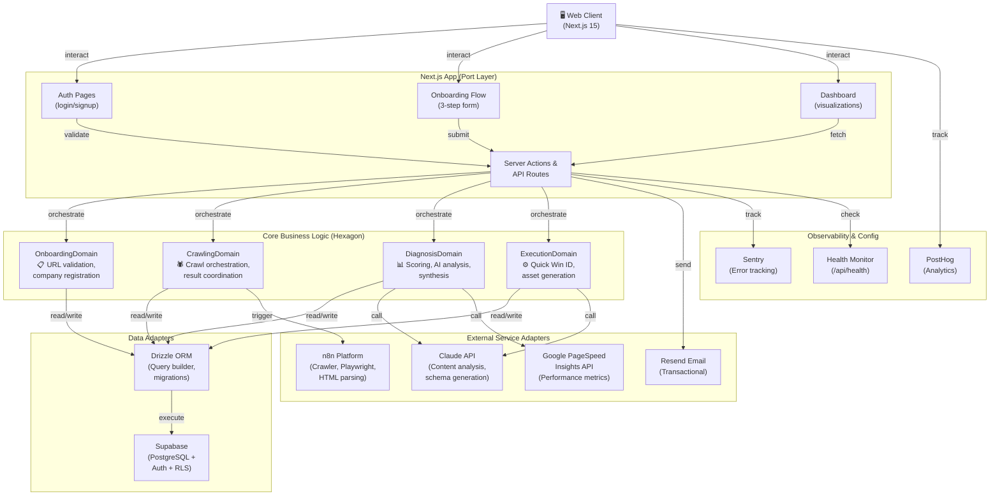
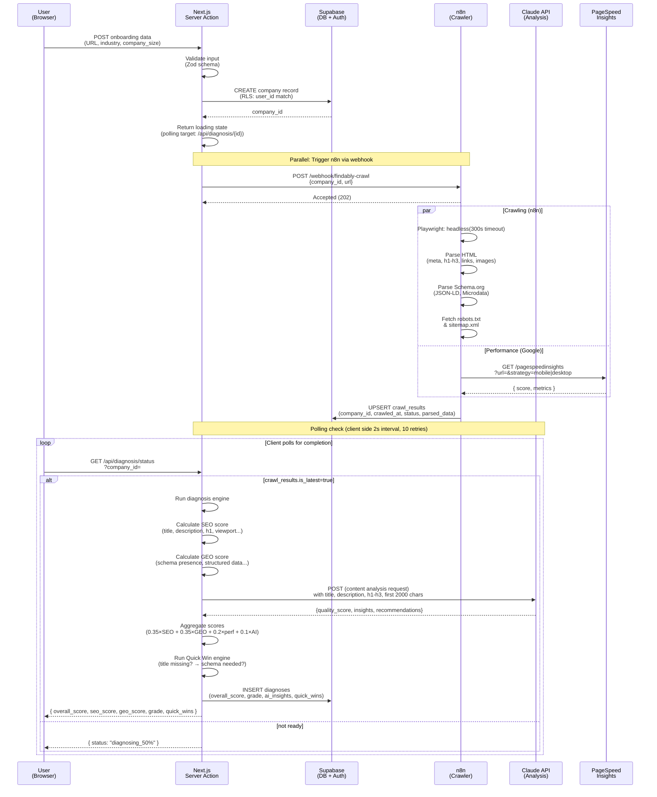
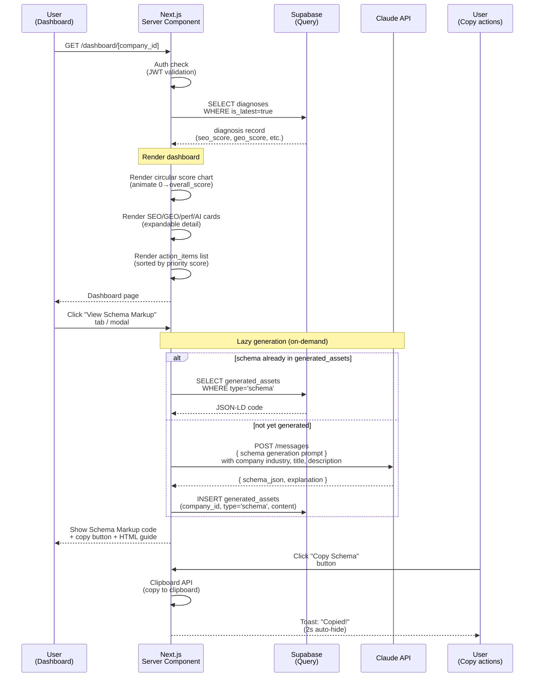
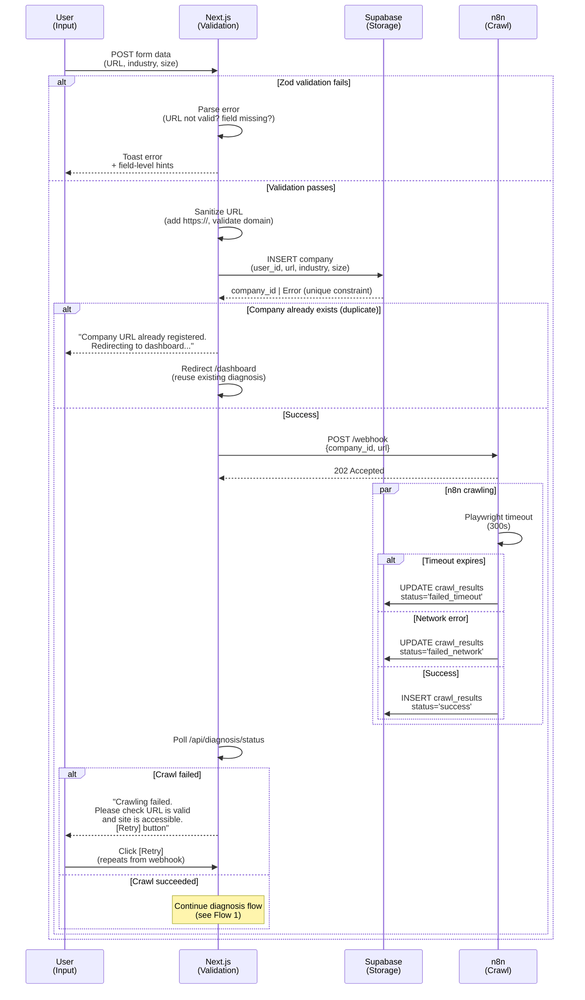

# Findably MVP — Technical Design Document

---

## Overview

**Purpose**: Findably delivers comprehensive AI-powered marketing diagnosis and execution automation to startup founders through a single URL input, eliminating the need for manual marketing audits and optimization work.

**Users**: Startup founders and small business owners managing self-hosted e-commerce sites who need quick, data-driven marketing insights without specialized SEO/GEO expertise.

**Impact**: Transforms manual marketing assessment (currently 4-8 hours of expert time) into an automated 5-minute onboarding flow followed by instant diagnosis and actionable recommendations.

### Goals
- Enable users to complete full marketing diagnosis in <5 minutes post-signup
- Provide data-driven SEO/GEO/performance scoring with AI-enhanced insights
- Generate immediately executable improvements (Schema Markup, meta tags) requiring zero technical knowledge
- Support multi-tenant SaaS architecture with user-level data isolation
- Achieve sub-3s API response times and reliable crawling even with network failures

### Non-Goals
- Crawl JavaScript-heavy SPAs with complex state rendering
- Provide real-time monitoring or scheduled re-diagnosis automation (MVP)
- Support direct integration with third-party platforms (CMS plugins, WordPress)
- Offer financial/payment processing (Phase 2)
- Provide advanced analytics beyond diagnosis metrics

---

## Requirements Traceability

Mapping all 40 requirements to design components and flows:

| Requirement | Summary | Primary Component | Supporting Components | Key Interface |
|---|---|---|---|---|
| 1.1–1.7 | User authentication (email/OAuth) | AuthService, AuthUI | Supabase Auth, JWT validation | AuthService interface |
| 2.1–2.6 | Database schema & RLS | DatabaseLayer | Drizzle ORM, Supabase | Drizzle schema definition |
| 3.1–3.6 | Routing & layout structure | AppRouter | LayoutComponents | Next.js route configuration |
| 4.1–4.6 | Landing page | LandingPage | SEO components, Animations | Static page rendering |
| 5.1–5.7 | Signup/login pages | AuthPages | Form validation (Zod) | AuthUI components |
| 6.1–6.7 | Onboarding flow (3-step) | OnboardingFlow | FormState, CompanyStore | OnboardingService interface |
| 7.1–7.6 | Crawling trigger API | CrawlTriggerAPI | n8n webhook client | ServerAction interface |
| 8.1–8.6 | n8n crawling workflow | n8nCrawler | Playwright integration, HTML parser | Webhook contract |
| 9.1–9.6 | HTML parser (meta/headings) | HTMLParser | Cheerio library | ParserService interface |
| 10.1–10.5 | Schema.org markup parser | SchemaParser | Cheerio, JSON-LD | ParserService interface |
| 11.1–11.5 | robots.txt & sitemap parser | SitemapParser | Fetch API | ParserService interface |
| 12.1–12.5 | PageSpeed Insights integration | PerformanceCollector | Google API client | ExternalService interface |
| 13.1–13.5 | Crawl result storage | CrawlResultStore | Supabase, RLS policies | DatabaseService interface |
| 14.1–14.4 | SEO scoring logic | SEOScorer | Scoring rules, metadata analysis | ScorerService interface |
| 15.1–15.4 | GEO scoring logic | GEOScorer | Schema detection, content analysis | ScorerService interface |
| 16.1–16.6 | Claude API content analysis | AIAnalyzer | Claude client, prompt engineering | AIService interface |
| 17.1–17.4 | Overall score calculation | ScoreAggregator | SEO/GEO/perf/AI scoring | ScorerService interface |
| 18.1–18.4 | Quick Win identification | QuickWinEngine | Rule-based detection | ActionItemService interface |
| 19.1–19.5 | Diagnosis result generation | DiagnosisEngine | All scorers, storage | DatabaseService interface |
| 20.1–20.5 | Schema Markup generation | SchemaGenerator | Claude API, Schema templates | GeneratorService interface |
| 21.1–21.5 | Meta tag optimization | MetaOptimizer | Claude API, HTML generation | GeneratorService interface |
| 22.1–22.4 | Action item prioritization | ActionPrioritizer | Matrix logic, impact scoring | ActionItemService interface |
| 23.1–23.5 | CMS detection & guides | CMSDetector | Pattern matching, guide templates | CMSService interface |
| 24.1–24.5 | Dashboard score visualization | DashboardUI | Chart component (shadcn), animations | ComponentUI interface |
| 25.1–25.4 | Action items list display | ActionListUI | Table/card component, filters | ComponentUI interface |
| 26.1–26.5 | Schema Markup code view | SchemaViewUI | Code syntax, clipboard API | ComponentUI interface |
| 27.1–27.4 | Meta tag comparison view | MetaViewUI | Side-by-side comparison | ComponentUI interface |
| 28.1–28.5 | AI insights card display | InsightsUI | Card components, modals | ComponentUI interface |
| 29.1–29.4 | Re-diagnosis trigger | RediagnoseAction | CrawlTriggerAPI, polling | ServerAction interface |
| 30.1–30.5 | Vercel deployment | DeploymentConfig | Environment setup, CI/CD | Deployment manifest |
| 31.1–31.5 | n8n server deployment | n8nConfig | Docker, Railway/Fly.io | Infrastructure config |
| 32.1–32.5 | Custom domain setup | DomainConfig | DNS, SSL certification | Infrastructure config |
| 33.1–33.5 | Error monitoring (Sentry) | ErrorTracking | Sentry SDK integration | Observability interface |
| 34.1–34.4 | Analytics (PostHog/GA4) | AnalyticsTracking | Event tracking, user segmentation | Observability interface |
| 35.1–35.6 | Security & RLS | SecurityLayer | Zod validation, JWT, RLS policies | Security interface |
| 36.1–36.5 | Performance targets | PerformanceOptimization | Image optimization, caching | Performance interface |
| 37.1–37.4 | Crawling timeout & retry | CrawlResilience | Error handling, exponential backoff | Resilience interface |
| 38.1–38.5 | WCAG accessibility | AccessibilityStandards | ARIA labels, keyboard nav | Accessibility interface |
| 39.1–39.4 | API request logging | RequestLogging | Structured logging, retention | Observability interface |
| 40.1–40.4 | Health check endpoint | HealthMonitor | Service availability checks | Health interface |

---

## Architecture

### Architecture Pattern & Boundary Map

**Selected Pattern**: Hexagonal Architecture (Ports & Adapters) with Server-Driven Composition

Rationale: Decouples core business logic (scoring, analysis, data persistence) from delivery mechanisms (API routes, UI components, external services like n8n/Claude). Each domain (OnboardingDomain, CrawlingDomain, DiagnosisDomain, ExecutionDomain) has clear boundaries and ownership, enabling parallel implementation without merge conflicts. Aligns with Next.js 15 Server Components and Server Actions paradigm.



**Domain Boundaries**:
- **OnboardingDomain**: Owns company registration, URL validation, user company mapping
- **CrawlingDomain**: Owns n8n coordination, result retrieval, HTML/Schema parsing orchestration
- **DiagnosisDomain**: Owns SEO/GEO/performance scoring, AI analysis, synthesis to diagnoses table
- **ExecutionDomain**: Owns Quick Win detection, Schema/meta tag generation, action items creation
- **DataLayer**: Manages Supabase connection, RLS policies, migration strategy (via Drizzle)
- **APILayer**: Bridges Next.js Server Actions/Routes to domain logic; handles error mapping

**Existing Patterns Preserved**:
- Next.js App Router folder structure (`src/app/(auth)`, `src/app/dashboard`, etc.)
- Supabase Auth + RLS as foundational multi-tenancy mechanism
- Environment variable management (.env.local)

**New Components Rationale**:
- **n8n integration layer**: Abstracts webhook trigger and polling logic; enables future webhook callback handling
- **AI analyzer module**: Centralizes Claude API calls for content analysis and generation; enables prompt evolution
- **Scoring services** (SEO, GEO): Rule-based, testable, domain-specific logic; enables A/B testing of weights
- **Health monitoring**: Essential for production observability with external dependencies

---

### Technology Stack

| Layer | Choice / Version | Role in Feature | Key Notes |
|---|---|---|---|
| **Frontend** | Next.js 15 (App Router) | Page routing, SSR, ISR | Server Components default; Server Actions for data mutations |
| **Styling** | Tailwind CSS v4 + shadcn/ui v4 | UI component framework | Supports @theme directive; auto-detection of component changes |
| **UI Components** | shadcn/ui v4 | Pre-built accessible components | Circular progress chart, form components, modals for details |
| **Form Validation** | Zod | Client + server schema validation | Shared between frontend and backend; prevents invalid submissions |
| **Backend Runtime** | Node.js 20+ (Vercel) | API routes, Server Actions | Vercel serverless; 10s timeout for long-running operations |
| **Database** | Supabase PostgreSQL 15 | Persistent data layer | Auto-backups, managed; RLS policies enforce tenant isolation |
| **ORM** | Drizzle ORM v0.30+ | Type-safe query builder | Zero-runtime overhead; generates migrations from schema |
| **Auth** | Supabase Auth (JWT) | User identity, session | Email + Google OAuth; JWT custom claims for RLS tenant_id |
| **External API** | Claude API (Sonnet) | Content analysis, schema generation | Token budget: ~50K tokens/diagnosis; structured output support |
| **External API** | Google PageSpeed Insights API | Performance metrics | Rate limit: 25K queries/day (with API key); null fallback if quota exceeded |
| **Crawling Engine** | n8n (self-hosted on Railway) | HTML crawling, parsing orchestration | Webhook trigger; Playwright for JS rendering; 300s timeout |
| **Email** | Resend | Transactional email (signup, alerts) | Free tier: 3000/month; Server Actions integration |
| **Error Tracking** | Sentry | Error monitoring, alerts | Captures frontend/backend exceptions; critical alerts via Slack |
| **Analytics** | PostHog | Event tracking, user segmentation | Open-source option available; tracks onboarding funnel metrics |
| **Monitoring** | Custom health endpoint | Service dependency checks | Polls Supabase, Claude, PageSpeed, n8n; returns degraded/unhealthy |

**Dependencies & External Constraints**:
- **Claude API**: Requires Anthropic API key; rate limits scale with billing; tokens consumed per request depend on content length
- **Google PageSpeed API**: Free tier 25K/day; applies across organization (shared quota risk)
- **Supabase RLS**: All queries must execute with authenticated JWT; bypassing requires service role (limited to webhooks)
- **n8n**: Self-hosted deployment required; network availability is critical for crawl success
- **Vercel**: Next.js full-stack serverless; Edge Functions not used (Deno runtime incompatible with Node.js dependencies)

---

## System Flows

### Flow 1: Onboarding → Diagnosis Flow



**Key Decisions**:
1. **Polling vs WebSocket**: Client-side polling (2s interval, max 10 retries = 20s) avoids WebSocket complexity; acceptable for MVP latency; fallback message after timeout
2. **Parallel crawl & analysis**: n8n runs crawl while Next.js waits for completion; Claude analysis starts only after crawl_results available (avoids redundant retries)
3. **Error resilience**: If PageSpeed API fails, crawl_results.performance_metrics = null; diagnosis proceeds with "data unavailable" note
4. **RLS isolation**: company_id enforced at Supabase level; next.js auth middleware validates session JWT before allowing access

---

### Flow 2: Diagnosis → Dashboard → Asset Generation



**Key Decisions**:
1. **Lazy schema/meta generation**: Generate only when user requests (reduces Claude API calls; avoids 25-second diagnosis delays)
2. **Caching generated assets**: Store in DB with is_latest flag; reuse if diagnosis unchanged
3. **CMS-aware guide display**: Query detected_cms from crawl_results; show templated guides (WordPress: use Yoast plugin, etc.)

---

### Flow 3: Data Validation & Error Handling (Happy Path + Failure Modes)



---

## Components and Interfaces

### Summary Table

| Component | Domain/Layer | Intent | Requirements | Key Dependencies | Contracts |
|---|---|---|---|---|---|
| **AuthService** | Security | JWT validation, user context extraction | 1.1–1.7 | Supabase Auth, jose (JWT) | Service, State |
| **OnboardingService** | OnboardingDomain | URL validation, company registration | 6.1–6.7 | Supabase, Zod, URLValidator | Service, API |
| **CrawlTriggerService** | CrawlingDomain | n8n webhook orchestration, polling logic | 7.1–7.6 | n8n client, Supabase | Service, Event |
| **HTMLParser** | CrawlingDomain (Adapter) | Meta/heading/link extraction | 9.1–9.6 | Cheerio, HTML stdlib | Service |
| **SchemaParser** | CrawlingDomain (Adapter) | JSON-LD & Microdata parsing | 10.1–10.5 | Cheerio, JSON validator | Service |
| **SitemapParser** | CrawlingDomain (Adapter) | robots.txt & sitemap.xml parsing | 11.1–11.5 | Fetch API, XML parser | Service |
| **PerformanceCollector** | CrawlingDomain (Adapter) | PageSpeed Insights API calls | 12.1–12.5 | Google API client, Zod validation | Service |
| **SEOScorer** | DiagnosisDomain | Rule-based SEO scoring (100-point scale) | 14.1–14.4 | CrawlResultData (parsed) | Service |
| **GEOScorer** | DiagnosisDomain | Rule-based GEO scoring (100-point scale) | 15.1–15.4 | CrawlResultData, SchemaData | Service |
| **AIAnalyzer** | DiagnosisDomain | Claude API integration for insights | 16.1–16.6 | Claude client, Zod (output validation) | Service |
| **ScoreAggregator** | DiagnosisDomain | Weighted score synthesis, grade assignment | 17.1–17.4 | All scorers | Service |
| **QuickWinEngine** | ExecutionDomain | Quick Win detection & prioritization | 18.1–18.4 | CrawlResultData, ScoringData | Service |
| **SchemaGenerator** | ExecutionDomain | JSON-LD generation (Organization, Product, etc.) | 20.1–20.5 | Claude API, Zod, Schema templates | Service |
| **MetaTagOptimizer** | ExecutionDomain | Meta tag improvement proposals | 21.1–21.5 | Claude API, Zod | Service |
| **ActionPrioritizer** | ExecutionDomain | Impact/effort matrix calculation | 22.1–22.4 | ActionItemData | Service |
| **CMSDetector** | ExecutionDomain | CMS identification & guide retrieval | 23.1–23.5 | Pattern matchers, guide templates | Service |
| **DashboardPage** | UI (Dashboard) | Score visualization, statistics | 24.1–24.5 | shadcn/ui (circular progress), animations | State, Component |
| **ActionItemsList** | UI (Dashboard) | Prioritized action items display | 25.1–25.4 | shadcn/ui (table/card), filters | Component |
| **SchemaMarkupViewer** | UI (Dashboard) | Code display + copy functionality | 26.1–26.5 | Syntax highlight, Clipboard API | Component |
| **MetaTagComparisonView** | UI (Dashboard) | Before/after meta tag display | 27.1–27.4 | Comparison layout, diff highlights | Component |
| **AIInsightsCard** | UI (Dashboard) | Top 3 problems + recommendations | 28.1–28.5 | Card component, modal expansion | Component |
| **HealthMonitor** | Observability | Service dependency health checks | 40.1–40.4 | Supabase, Claude, PageSpeed, n8n clients | Service, API |

---

### Domain: Onboarding

#### AuthService

| Field | Detail |
|---|---|
| Intent | Authenticate users via email/password or Google OAuth; manage JWT tokens and session state |
| Requirements | 1.1, 1.2, 1.3, 1.4, 1.5, 1.6, 1.7 |

**Responsibilities & Constraints**
- Delegate authentication to Supabase Auth (OAuth providers, email verification)
- Extract user_id from JWT claims; validate token presence on protected routes
- Store JWT in httpOnly cookie (frontend cannot read; protects against XSS)
- Enforce email verification before dashboard access (async email flow)
- Support session expiration (24-hour JWT lifetime recommended)

**Dependencies**
- Inbound: Next.js middleware, Server Actions — require authenticated context (P0 blocking)
- Outbound: Supabase Auth service — authentication backend (P0 blocking)
- External: jose library (JWT parsing), @supabase/auth-helpers-nextjs — official SDK (P1 security-critical)

**Contracts**: Service [x] / API [x]

##### Service Interface
```typescript
interface AuthService {
  signUp(email: string, password: string): Promise<Result<User, AuthError>>;
  signIn(email: string, password: string): Promise<Result<{ user: User; session: Session }, AuthError>>;
  signInWithGoogle(code: string): Promise<Result<{ user: User; session: Session }, AuthError>>;
  signOut(): Promise<Result<void, AuthError>>;
  validateSession(token: string): Result<{ userId: string; email: string }, TokenError>;
  verifyEmail(token: string): Promise<Result<void, VerificationError>>;
}

type AuthError =
  | { kind: 'EmailAlreadyExists' }
  | { kind: 'InvalidCredentials' }
  | { kind: 'VerificationRequired' }
  | { kind: 'ServiceError'; message: string };

type TokenError = { kind: 'TokenExpired' } | { kind: 'TokenInvalid' };
```

- **Preconditions**: Email/password must pass Zod validation (8+ chars, special chars)
- **Postconditions**: On success, JWT issued and stored; email verification link sent async
- **Invariants**: Session must contain user_id; cannot be modified client-side

##### API Contract
| Method | Endpoint | Request | Response | Errors |
|---|---|---|---|---|
| POST | /api/auth/signup | `{email, password}` | `{user: User}` | 400 (invalid email), 409 (exists), 500 |
| POST | /api/auth/signin | `{email, password}` | `{user: User, sessionToken}` | 401 (wrong creds), 403 (unverified), 500 |
| POST | /api/auth/google/callback | `{code, state}` | `{user: User, sessionToken}` | 400 (invalid code), 500 |
| POST | /api/auth/verify-email | `{token}` | `{verified: true}` | 400 (invalid/expired), 500 |
| POST | /api/auth/signout | (none) | `{success: true}` | 401, 500 |

**Implementation Notes**
- Integration: Use Supabase CLI for local auth testing; PostgreSQL JWT extension handles token signing
- Validation: Zod schema validates email format, password strength on client + server
- Risks: OAuth redirect URIs must match Vercel preview/production URLs exactly; failure causes auth loop

---

#### OnboardingService

| Field | Detail |
|---|---|
| Intent | Orchestrate 3-step form flow, validate URL, create company record, trigger crawl |
| Requirements | 6.1, 6.2, 6.3, 6.4, 6.5, 6.6, 6.7 |

**Responsibilities & Constraints**
- Validate URL format (https required, valid domain, reachable health check)
- Parse and store industry (enum: e-commerce, blog, saas, local-business, other)
- Parse company size (enum: solo, small-2-10, medium-11-50)
- Insert company record with user_id + RLS policy enforcement
- Trigger n8n webhook asynchronously; return company_id to client
- Handle duplicate URL registration (redirect to existing dashboard)

**Dependencies**
- Inbound: Client form submissions (P0)
- Outbound: Supabase (company table insert, RLS) (P0); n8n webhook client (P1 async)
- External: URLValidator library, Zod (input validation)

**Contracts**: Service [x] / API [x]

##### Service Interface
```typescript
interface OnboardingService {
  completeOnboarding(input: {
    userId: string;
    url: string;
    industry: 'ecommerce' | 'blog' | 'saas' | 'local_business' | 'other';
    companySize: 'solo' | 'small' | 'medium';
  }): Promise<Result<{ companyId: string; crawlStarted: boolean }, OnboardingError>>;
}

type OnboardingError =
  | { kind: 'InvalidURL'; message: string }
  | { kind: 'URLUnreachable'; message: string }
  | { kind: 'DuplicateCompany'; existingCompanyId: string }
  | { kind: 'ValidationError'; field: string; message: string }
  | { kind: 'ServiceError'; message: string };
```

- **Preconditions**: User must be authenticated; URL must be valid HTTPS
- **Postconditions**: Company record created; n8n webhook triggered; polling target returned
- **Invariants**: user_id always matches authenticated session; no stale records possible

##### API Contract
| Method | Endpoint | Request | Response | Errors |
|---|---|---|---|---|
| POST | /api/onboarding/complete | `{url, industry, companySize}` | `{companyId, statusUrl}` | 400 (invalid), 409 (duplicate), 500 |

**Implementation Notes**
- Integration: Server Action pattern (Next.js 15); runs on server after form validation
- Validation: Zod validates input; URLValidator library checks format + DNS resolution
- Risks: URL reachability check adds 2-3s latency; timeout if target site slow

---

### Domain: Crawling

#### CrawlTriggerService

| Field | Detail |
|---|---|
| Intent | Invoke n8n webhook with company_id + URL; poll for completion; retrieve crawl_results |
| Requirements | 7.1, 7.2, 7.3, 7.4, 7.5, 7.6 |

**Responsibilities & Constraints**
- POST to n8n webhook with auth header (N8N_WEBHOOK_URL env var)
- Handle 202 Accepted response; implement exponential backoff retry on transient failures
- Poll Supabase crawl_results table for is_latest=true (up to 10 retries, 2s intervals = 20s max)
- Return crawl_results on success; throw timeout error if polling max exceeded
- Capture failure status (failed_timeout, failed_network, failed_invalid_url) and surface to client

**Dependencies**
- Inbound: OnboardingService, RediagnoseAction (P0)
- Outbound: n8n platform (HTTP POST) (P1 external), Supabase query (P0)
- External: node-fetch or native fetch API; exponential-backoff utility (P2 optional)

**Contracts**: Service [x] / Event [x]

##### Service Interface
```typescript
interface CrawlTriggerService {
  triggerCrawl(companyId: string, url: string): Promise<Result<{ webhookId: string }, CrawlError>>;
  pollForCompletion(companyId: string, maxRetries?: number): Promise<Result<CrawlResult, CrawlError>>;
}

type CrawlError =
  | { kind: 'WebhookFailed'; status: number; message: string }
  | { kind: 'CrawlTimeout'; elapsedSeconds: number }
  | { kind: 'CrawlFailed'; reason: 'network' | 'timeout' | 'invalid_url'; details: string }
  | { kind: 'ServiceError'; message: string };
```

- **Preconditions**: URL must be valid HTTPS; company_id must exist
- **Postconditions**: Webhook triggered (may not complete immediately); polling target available
- **Invariants**: Crawl status changes monotonically: pending → (success | failed_*)

##### Event Contract
- **Published events**: `crawl_triggered` (company_id, url, timestamp), `crawl_completed` (company_id, status)
- **Subscribed events**: None (fire-and-forget webhook model)
- **Ordering guarantees**: Single crawl per company_id at a time; previous crawl marked is_latest=false

**Implementation Notes**
- Integration: Server Action calls this on form submission; returns status polling URL to client
- Validation: URL format checked before webhook invocation
- Risks: n8n downtime blocks all crawls; implement circuit breaker (fail-fast after 3 failures)

---

#### HTMLParser

| Field | Detail |
|---|---|
| Intent | Extract meta tags, headings, links, images from raw HTML; normalize encoding |
| Requirements | 9.1, 9.2, 9.3, 9.4, 9.5, 9.6 |

**Responsibilities & Constraints**
- Parse HTML using Cheerio (lightweight, no browser); handle UTF-8 + EUC-KR encodings
- Extract: title, meta description, meta charset, viewport, og:*, twitter:* tags
- Extract all h1, h2, h3 tags with text content and depth level
- Classify links: internal (same domain), external (different domain), broken (404 detected)
- Extract img tags: src, alt text presence, width/height attributes
- Mark missing critical meta tags (title, description) explicitly as "MISSING"

**Dependencies**
- Inbound: n8n crawler (receives HTML content) (P0)
- Outbound: Cheerio library — DOM parsing (P0 external)
- External: none (stdlib only after Cheerio load)

**Contracts**: Service [x]

##### Service Interface
```typescript
interface HTMLParser {
  parse(html: string): Result<ParsedHTML, ParseError>;
}

interface ParsedHTML {
  meta: {
    title: string | null;
    description: string | null;
    charset: string;
    viewport: boolean;
    ogTags: Record<string, string>;
    twitterTags: Record<string, string>;
  };
  headings: Array<{ level: 1 | 2 | 3; text: string }>;
  links: {
    internal: number;
    external: number;
    broken: number;
  };
  images: Array<{
    src: string;
    hasAlt: boolean;
    width?: number;
    height?: number;
  }>;
}

type ParseError = { kind: 'InvalidHTML' | 'EncodingError'; message: string };
```

- **Preconditions**: HTML must be valid UTF-8 or EUC-KR encoded
- **Postconditions**: Parsed structure contains all extracted fields; no truncation
- **Invariants**: Missing fields set to null, not omitted; enables consistent downstream logic

**Implementation Notes**
- Integration: Called by n8n workflow after Playwright capture
- Validation: Cheerio safely handles malformed HTML; no exception thrown
- Risks: Large HTML (>5MB) may cause memory spike; implement size check before parsing

---

#### SchemaParser

| Field | Detail |
|---|---|
| Intent | Parse JSON-LD and Microdata Schema.org markup; extract key properties |
| Requirements | 10.1, 10.2, 10.3, 10.4, 10.5 |

**Responsibilities & Constraints**
- Parse JSON-LD blocks within `<script type="application/ld+json">` tags
- Recognize Schema types: Product, LocalBusiness, Organization, BlogPosting, FAQPage, BreadcrumbList
- Extract key properties: @type, @context, name, description, url, image, aggregateRating, etc.
- Convert Microdata (itemscope, itemtype, itemprop) to JSON equivalents
- Mark as "no_schema" if no structured data found; enable downstream scoring logic

**Dependencies**
- Inbound: HTMLParser output (P0)
- Outbound: Cheerio (DOM access) (P0)
- External: JSON validator (Zod) for schema compliance (P1)

**Contracts**: Service [x]

##### Service Interface
```typescript
interface SchemaParser {
  parse(html: Document): Result<ParsedSchema, SchemaError>;
}

interface ParsedSchema {
  schemaFound: boolean;
  schemas: Array<{
    type: string;
    context: string;
    properties: Record<string, unknown>;
  }>;
  detectedTypes: string[]; // e.g., ['Organization', 'Product']
}

type SchemaError = { kind: 'ParseError' | 'ValidationError'; message: string };
```

- **Preconditions**: HTML must be pre-parsed by HTMLParser
- **Postconditions**: All JSON-LD blocks extracted; types normalized
- **Invariants**: If no schema found, detectedTypes = []; no exception thrown

**Implementation Notes**
- Integration: Runs after HTMLParser; output feeds into GEOScorer
- Validation: Zod validates each schema @type against known Schema.org registry
- Risks: Malformed JSON-LD may cause parse error; implement try-catch with "invalid_schema" fallback

---

#### PerformanceCollector

| Field | Detail |
|---|---|
| Intent | Invoke Google PageSpeed Insights API; cache results; handle quota exhaustion |
| Requirements | 12.1, 12.2, 12.3, 12.4, 12.5 |

**Responsibilities & Constraints**
- Call PageSpeed Insights API with GOOGLE_PAGESPEED_API_KEY (env var)
- Fetch mobile + desktop scores (0-100), Core Web Vitals (LCP, FID, CLS)
- Implement retry logic with exponential backoff (quota limits: 25K/day, 400/100s)
- If quota exceeded or network error, return null scores; log warning; proceed with diagnosis
- Cache results by URL + timestamp (24-hour TTL); avoid duplicate API calls

**Dependencies**
- Inbound: CrawlTriggerService (P0)
- Outbound: Google PageSpeed Insights API (P1 external), cache layer (P2 optional)
- External: @google-cloud/pagespeed-insights SDK or raw fetch (P1)

**Contracts**: Service [x]

##### Service Interface
```typescript
interface PerformanceCollector {
  getPerformanceMetrics(url: string): Promise<Result<PerformanceMetrics, PerformanceError>>;
}

interface PerformanceMetrics {
  mobile: { score: number; cwv: CoreWebVitals } | null;
  desktop: { score: number; cwv: CoreWebVitals } | null;
  fetchedAt: Date;
}

interface CoreWebVitals {
  lcp: number | null; // Largest Contentful Paint (ms)
  fid: number | null; // First Input Delay (ms)
  cls: number | null; // Cumulative Layout Shift (unitless)
}

type PerformanceError =
  | { kind: 'QuotaExceeded' }
  | { kind: 'NetworkError'; message: string }
  | { kind: 'InvalidURL' };
```

- **Preconditions**: URL must be valid HTTPS; API key must be set
- **Postconditions**: Metrics returned (possibly with null values); no exception thrown
- **Invariants**: Score always in range [0, 100] or null; CWV values always >= 0 or null

##### API Contract (Google)
| Method | Endpoint | Request | Response | Rate Limit |
|---|---|---|---|---|
| GET | /pagespeedinsights/v5 | `url, strategy (mobile\|desktop), key` | `{score, metrics, ...}` | 25K/day, 400/100s |

**Implementation Notes**
- Integration: Called during crawl workflow; results stored in crawl_results.performance_metrics JSON
- Validation: Zod validates response schema; catches API contract changes
- Risks: API deprecation (Google plans to discontinue CrUX data); add fallback scoring logic

---

### Domain: Diagnosis

#### SEOScorer

| Field | Detail |
|---|---|
| Intent | Calculate SEO readiness score (0-100) based on meta tags, structure, crawlability |
| Requirements | 14.1, 14.2, 14.3, 14.4 |

**Responsibilities & Constraints**
- Score title tag (20 pts): present + 50-60 chars = full; missing/wrong length = 0
- Score meta description (20 pts): present + 120-160 chars = full; missing = 0
- Score H1 tag (15 pts): exactly 1 H1 = full; 0 or >1 = 0
- Score viewport meta (15 pts): mobile-responsive viewport tag = full; missing = 0
- Score internal link structure (15 pts): max depth ≤ 3 = full; deeper = 0
- Score sitemap (10 pts): robots.txt mentions sitemap = full; missing = 0
- Score robots.txt (5 pts): file exists = full; missing = 0
- Return itemized scores + total; identify missing items for action items

**Dependencies**
- Inbound: HTMLParser, SitemapParser, CrawlResultData (P0)
- Outbound: None (pure logic)
- External: None

**Contracts**: Service [x]

##### Service Interface
```typescript
interface SEOScorer {
  score(crawlResult: CrawlResult): Result<SEOScore, ScoringError>;
}

interface SEOScore {
  overall: number; // 0-100
  items: Array<{
    name: string; // "Title Tag"
    maxScore: number;
    earned: number;
    status: 'pass' | 'fail' | 'partial';
  }>;
  missing: string[]; // ["title_tag", "meta_description"]
}

type ScoringError = { kind: 'InvalidInput'; message: string };
```

- **Preconditions**: CrawlResult must contain parsed meta, headings, robots, sitemap
- **Postconditions**: overall + items returned; all items sum to overall score
- **Invariants**: 0 ≤ overall ≤ 100; each item 0 ≤ earned ≤ maxScore

**Implementation Notes**
- Integration: Called by DiagnosisEngine after crawl completion
- Validation: Input validation checks for null crawl_results
- Risks: Scoring weights may require tuning; A/B test with competitors' sites

---

#### GEOScorer

| Field | Detail |
|---|---|
| Intent | Calculate GEO (AI-search) readiness score based on structured data, content quality |
| Requirements | 15.1, 15.2, 15.3, 15.4 |

**Responsibilities & Constraints**
- Score Schema.org markup (30 pts): ≥1 valid schema = full; none = 0
- Score structured data types (20 pts): Product/Org/LocalBusiness present = full; missing = 0
- Score FAQ Schema (15 pts): FAQPage present = full; missing = 0
- Score content length (15 pts): main content ≥500 chars = full; <500 = 0
- Score image optimization (15 pts): all imgs have alt text + valid format = full; missing alt = partial
- Score E-E-A-T signals (5 pts): author bio + pub date + author URL present = full; partial = variable
- Return itemized scores + total; identify quick wins

**Dependencies**
- Inbound: SchemaParser, HTMLParser (content extraction), CrawlResultData (P0)
- Outbound: None (pure logic)
- External: None

**Contracts**: Service [x]

##### Service Interface
```typescript
interface GEOScorer {
  score(crawlResult: CrawlResult, schemas: ParsedSchema): Result<GEOScore, ScoringError>;
}

interface GEOScore {
  overall: number; // 0-100
  items: Array<{ name: string; maxScore: number; earned: number; status: 'pass' | 'fail' | 'partial' }>;
  missing: string[];
}
```

- **Preconditions**: Must have parsed schemas + HTML content
- **Postconditions**: overall + items returned; identifies quick wins (schema missing = high impact)
- **Invariants**: 0 ≤ overall ≤ 100

**Implementation Notes**
- Integration: Called by DiagnosisEngine; feeds into overall score calculation
- Validation: Checks for malformed schemas before scoring
- Risks: E-E-A-T signals fuzzy; may require manual review or Claude enhancement

---

#### AIAnalyzer

| Field | Detail |
|---|---|
| Intent | Invoke Claude API for content analysis, insights, recommendations |
| Requirements | 16.1, 16.2, 16.3, 16.4, 16.5, 16.6 |

**Responsibilities & Constraints**
- Prepare prompt with: title, description, h1-h3, first 2000 chars of main content, industry/keywords
- Call Claude API (Sonnet) with structured output request (JSON schema for analysis result)
- Parse response: quality_score (0-100), top_3_problems, top_3_recommendations
- Implement retry logic (exponential backoff); timeout after 30s; return null if Claude unavailable
- Cache results by company_id + crawl_timestamp (avoid re-analysis of identical content)

**Dependencies**
- Inbound: DiagnosisEngine (P0)
- Outbound: Claude API (Anthropic) (P0 external), Supabase cache (P2 optional)
- External: @anthropic-ai/sdk, Zod (output validation) (P0)

**Contracts**: Service [x]

##### Service Interface
```typescript
interface AIAnalyzer {
  analyzeContent(input: AnalysisInput): Promise<Result<AIInsights, AIError>>;
}

interface AnalysisInput {
  title: string;
  description: string;
  headings: Array<{ level: 1 | 2 | 3; text: string }>;
  content: string; // first 2000 chars
  industry: string;
  keywords?: string[];
}

interface AIInsights {
  contentQuality: number; // 0-100
  problems: Array<{ rank: 1 | 2 | 3; description: string; impact: 'high' | 'medium' | 'low' }>;
  recommendations: Array<{ rank: 1 | 2 | 3; action: string; benefit: string }>;
}

type AIError =
  | { kind: 'APIError'; message: string }
  | { kind: 'Timeout' }
  | { kind: 'InvalidInput'; message: string }
  | { kind: 'RateLimited' };
```

- **Preconditions**: Content must be >100 chars; industry must be valid
- **Postconditions**: Insights returned (may be cached); structure guaranteed by Zod validation
- **Invariants**: 0 ≤ contentQuality ≤ 100; problems and recommendations in priority order

##### Structured Output Schema (Claude)
```json
{
  "type": "object",
  "properties": {
    "contentQuality": { "type": "number", "minimum": 0, "maximum": 100 },
    "problems": {
      "type": "array",
      "items": {
        "type": "object",
        "properties": {
          "rank": { "enum": [1, 2, 3] },
          "description": { "type": "string", "maxLength": 200 },
          "impact": { "enum": ["high", "medium", "low"] }
        },
        "required": ["rank", "description", "impact"]
      },
      "maxItems": 3
    },
    "recommendations": {
      "type": "array",
      "items": {
        "type": "object",
        "properties": {
          "rank": { "enum": [1, 2, 3] },
          "action": { "type": "string", "maxLength": 200 },
          "benefit": { "type": "string", "maxLength": 150 }
        },
        "required": ["rank", "action", "benefit"]
      },
      "maxItems": 3
    }
  },
  "required": ["contentQuality", "problems", "recommendations"]
}
```

**Implementation Notes**
- Integration: Called after SEO/GEO scores calculated; contributes 10% to overall score
- Validation: Zod enforces structured output; catches API schema drift
- Risks: Claude token consumption ~3K tokens/diagnosis; monitor quota; implement daily budget cap

---

### Domain: Execution

#### SchemaGenerator

| Field | Detail |
|---|---|
| Intent | Generate JSON-LD Schema Markup code for Organization, Product, BlogPosting, LocalBusiness |
| Requirements | 20.1, 20.2, 20.3, 20.4, 20.5 |

**Responsibilities & Constraints**
- Accept crawl_result + industry; determine appropriate schema types
- E-commerce → Product schema (auto-map title→name, description, og:image→image)
- SaaS/Service → Organization + LocalBusiness schema
- Blog → BlogPosting schema (extract publish date, author from HTML if available)
- Generate JSON-LD code block; validate against schema.org spec
- Return formatted code + explanation; store in generated_assets for reuse

**Dependencies**
- Inbound: ExecutionDomain (lazy call from dashboard) (P0)
- Outbound: Claude API (optional: generate custom properties) (P1); JSON validator (P0)
- External: @types/schema-dts (TypeScript schema definitions) (P1 optional)

**Contracts**: Service [x]

##### Service Interface
```typescript
interface SchemaGenerator {
  generateSchema(input: SchemaInput): Promise<Result<GeneratedSchema, GeneratorError>>;
}

interface SchemaInput {
  industry: string;
  title: string;
  description: string;
  url: string;
  logoUrl?: string;
  contactInfo?: { telephone?: string; email?: string };
}

interface GeneratedSchema {
  schemaType: 'Organization' | 'Product' | 'BlogPosting' | 'LocalBusiness';
  jsonLd: object; // Valid JSON-LD
  html: string; // Ready-to-paste <script> tag
  explanation: string; // Why this schema is recommended
}

type GeneratorError = { kind: 'ValidationError' | 'UnsupportedIndustry'; message: string };
```

- **Preconditions**: industry must be recognized; title + description must not be empty
- **Postconditions**: jsonLd passes schema.org validation; html ready for copy-paste
- **Invariants**: @context always "https://schema.org"; @type always present

**Implementation Notes**
- Integration: Triggered when user clicks "Generate Schema" on dashboard; stored for reuse
- Validation: Zod validates output against schema.org spec via type definitions
- Risks: Missing required fields (logo, contact) → prompt user to fill gaps before generation

---

#### MetaTagOptimizer

| Field | Detail |
|---|---|
| Intent | Generate optimized meta tag recommendations using Claude API |
| Requirements | 21.1, 21.2, 21.3, 21.4, 21.5 |

**Responsibilities & Constraints**
- Prepare prompt with current title/description, industry, target keywords
- Call Claude to generate: improved title (50-60 chars), description (120-160 chars), og:* tags, twitter:* tags
- Include reasoning for each change (e.g., "Added keyword 'SaaS' for 15% CTR boost")
- Return before/after comparison; HTML snippet for copy-paste
- Store in generated_assets for reuse; enable manual editing

**Dependencies**
- Inbound: ExecutionDomain (lazy) (P0)
- Outbound: Claude API (P0); Zod validation (P0)
- External: None

**Contracts**: Service [x]

##### Service Interface
```typescript
interface MetaTagOptimizer {
  optimizeMeta(input: MetaOptInput): Promise<Result<MetaOptOutput, OptimizerError>>;
}

interface MetaOptInput {
  currentTitle: string;
  currentDescription: string;
  industry: string;
  targetKeywords?: string[];
  targetAudience?: string;
}

interface MetaOptOutput {
  recommendations: Array<{
    tag: 'title' | 'description' | 'og:title' | 'og:description' | 'og:image' | 'twitter:title' | 'twitter:description';
    current: string;
    recommended: string;
    reasoning: string;
    estimatedImpact?: string; // "CTR +15%"
  }>;
  htmlSnippet: string; // Ready to copy
}

type OptimizerError = { kind: 'APIError' | 'ValidationError'; message: string };
```

- **Preconditions**: currentTitle + currentDescription must not be empty
- **Postconditions**: All recommendations include reasoning; HTML snippet valid
- **Invariants**: Recommended title length 50-60; description 120-160

**Implementation Notes**
- Integration: Lazy-loaded on dashboard; allows manual override before save
- Validation: Zod checks length constraints
- Risks: Claude may suggest keywords not aligned with user intent; allow editing + re-generation

---

### Domain: Data Layer (Drizzle + Supabase)

#### DatabaseLayer

| Field | Detail |
|---|---|
| Intent | Provide type-safe query builder (Drizzle ORM) and RLS policy enforcement via Supabase |
| Requirements | 2.1–2.6, 13.1–13.5, 19.1–19.5 |

**Responsibilities & Constraints**
- Define 6 tables: users (from Supabase Auth), companies, crawl_results, diagnoses, action_items, generated_assets
- Enable Row Level Security (RLS) on all tables; enforce company_id isolation
- Implement Drizzle migrations for schema versioning
- Provide client instances: authenticated (respects RLS) + admin (bypasses RLS for webhooks)
- Handle transaction boundaries for multi-step operations (e.g., insert crawl + diagnoses atomically)

**Dependencies**
- Inbound: All domain services (P0)
- Outbound: Supabase PostgreSQL (P0); Drizzle ORM library (P0)
- External: drizzle-orm, @supabase/supabase-js (P0)

**Contracts**: Service [x]

##### Physical Data Model (Drizzle Schema)

```typescript
// src/db/schema.ts

import { pgTable, text, serial, timestamp, json, boolean, numeric, varchar } from 'drizzle-orm/pg-core';

export const companiesTable = pgTable(
  'companies',
  {
    id: serial('id').primaryKey(),
    userId: text('user_id').notNull(), // FK to Supabase Auth
    url: varchar('url', { length: 500 }).notNull().unique(),
    industry: varchar('industry', { enum: ['ecommerce', 'blog', 'saas', 'local_business', 'other'] }).notNull(),
    companySize: varchar('company_size', { enum: ['solo', 'small', 'medium'] }).notNull(),
    createdAt: timestamp('created_at').defaultNow().notNull(),
    updatedAt: timestamp('updated_at').defaultNow().notNull(),
  },
  (table) => ({
    userIdIdx: index('companies_user_id_idx').on(table.userId),
    urlIdx: index('companies_url_idx').on(table.url),
  })
);

export const crawlResultsTable = pgTable(
  'crawl_results',
  {
    id: serial('id').primaryKey(),
    companyId: serial('company_id').references(() => companiesTable.id, { onDelete: 'cascade' }).notNull(),
    crawledAt: timestamp('crawled_at').defaultNow().notNull(),
    status: varchar('status', {
      enum: ['success', 'failed_timeout', 'failed_network', 'failed_invalid_url']
    }).notNull(),
    rawHtml: text('raw_html'), // max 5MB; truncate if exceeded
    htmlTruncated: boolean('html_truncated').default(false),
    metaTags: json('meta_tags'), // { title, description, og:*, twitter:* }
    headings: json('headings'), // [{ level: 1-3, text: string }]
    schemaMarkup: json('schema_markup'), // [{ @type, properties }]
    performanceMetrics: json('performance_metrics'), // { mobile: { score, cwv }, desktop: { score, cwv } }
    robotsTxt: text('robots_txt'),
    sitemapInfo: json('sitemap_info'), // { urlCount, lastModified }
    detectedCms: varchar('detected_cms', { enum: ['wordpress', 'shopify', 'wix', 'cafe24', ...] }),
    isLatest: boolean('is_latest').default(true),
  },
  (table) => ({
    companyIdIdx: index('crawl_results_company_id_idx').on(table.companyId),
    isLatestIdx: index('crawl_results_is_latest_idx').on(table.isLatest),
  })
);

export const diagnosesTable = pgTable(
  'diagnoses',
  {
    id: serial('id').primaryKey(),
    companyId: serial('company_id').references(() => companiesTable.id, { onDelete: 'cascade' }).notNull(),
    crawlResultId: serial('crawl_result_id').references(() => crawlResultsTable.id),
    diagnosedAt: timestamp('diagnosed_at').defaultNow().notNull(),
    seoScore: numeric('seo_score', { precision: 3, scale: 1 }),
    geoScore: numeric('geo_score', { precision: 3, scale: 1 }),
    performanceScore: numeric('performance_score', { precision: 3, scale: 1 }),
    aiScore: numeric('ai_score', { precision: 3, scale: 1 }),
    overallScore: numeric('overall_score', { precision: 3, scale: 1 }).notNull(),
    grade: varchar('grade', { enum: ['A', 'B', 'C', 'D', 'F'] }).notNull(),
    aiInsights: json('ai_insights'), // { problems: [], recommendations: [] }
    isLatest: boolean('is_latest').default(true),
  },
  (table) => ({
    companyIdIdx: index('diagnoses_company_id_idx').on(table.companyId),
    isLatestIdx: index('diagnoses_is_latest_idx').on(table.isLatest),
  })
);

export const actionItemsTable = pgTable(
  'action_items',
  {
    id: serial('id').primaryKey(),
    companyId: serial('company_id').references(() => companiesTable.id, { onDelete: 'cascade' }).notNull(),
    diagnosisId: serial('diagnosis_id').references(() => diagnosesTable.id, { onDelete: 'cascade' }).notNull(),
    itemType: varchar('item_type', { enum: ['quick_win', 'standard', 'long_term'] }).notNull(),
    title: varchar('title', { length: 255 }).notNull(),
    description: text('description').notNull(),
    priority: varchar('priority', { enum: ['high', 'medium', 'low'] }).notNull(),
    expectedImpactScore: numeric('expected_impact_score', { precision: 3, scale: 1 }),
    estimatedEffort: varchar('estimated_effort', { enum: ['<1h', '1-8h', '>8h'] }),
    completed: boolean('completed').default(false),
  },
  (table) => ({
    companyIdIdx: index('action_items_company_id_idx').on(table.companyId),
    diagnosisIdIdx: index('action_items_diagnosis_id_idx').on(table.diagnosisId),
  })
);

export const generatedAssetsTable = pgTable(
  'generated_assets',
  {
    id: serial('id').primaryKey(),
    companyId: serial('company_id').references(() => companiesTable.id, { onDelete: 'cascade' }).notNull(),
    diagnosisId: serial('diagnosis_id').references(() => diagnosesTable.id, { onDelete: 'cascade' }),
    assetType: varchar('asset_type', { enum: ['schema_markup', 'meta_tags', 'guide'] }).notNull(),
    content: json('content'), // Flexible schema based on type
    generatedAt: timestamp('generated_at').defaultNow().notNull(),
  },
  (table) => ({
    companyIdIdx: index('generated_assets_company_id_idx').on(table.companyId),
  })
);
```

**RLS Policies**:
```sql
-- Enable RLS on all tables
ALTER TABLE companies ENABLE ROW LEVEL SECURITY;
ALTER TABLE crawl_results ENABLE ROW LEVEL SECURITY;
ALTER TABLE diagnoses ENABLE ROW LEVEL SECURITY;
ALTER TABLE action_items ENABLE ROW LEVEL SECURITY;
ALTER TABLE generated_assets ENABLE ROW LEVEL SECURITY;

-- companies: user can see only their own
CREATE POLICY companies_select_own ON companies
  FOR SELECT USING (auth.uid()::text = user_id);

CREATE POLICY companies_insert_own ON companies
  FOR INSERT WITH CHECK (auth.uid()::text = user_id);

-- crawl_results: user can see via company_id FK
CREATE POLICY crawl_results_select_own ON crawl_results
  FOR SELECT USING (
    company_id IN (
      SELECT id FROM companies WHERE user_id = auth.uid()::text
    )
  );

-- Similar for diagnoses, action_items, generated_assets
```

**Drizzle Client Setup**:
```typescript
// src/lib/db/client.ts
import { drizzle } from 'drizzle-orm/postgres-js';
import postgres from 'postgres';
import * as schema from './schema';

// Authenticated client (respects RLS)
export const authenticatedDb = (token: string) => {
  const client = postgres(process.env.DATABASE_URL!, {
    prepare: false, // Required for connection pooling
    token,
  });
  return drizzle(client, { schema });
};

// Admin client (bypasses RLS)
export const adminDb = () => {
  const client = postgres(process.env.DATABASE_URL!, {
    prepare: false,
  });
  return drizzle(client, { schema });
};
```

---

### Domain: UI Layer

#### DashboardPage (Server Component)

| Field | Detail |
|---|---|
| Intent | Display comprehensive marketing diagnosis with score visualization, action items, generated assets |
| Requirements | 24.1–24.5, 25.1–25.4, 26.1–26.5, 27.1–27.4, 28.1–28.5, 29.1–29.4 |

**Responsibilities & Constraints**
- Fetch latest diagnosis + crawl_results + action_items for authenticated user
- Render circular progress chart (animate 0 → overall_score over 1s)
- Render 4 category cards (SEO, GEO, Perf, AI) with expandable details
- Lazy-load schema/meta tag content; generate on-demand via Claude
- Render action items as filterable tabs (Quick Win, Standard, Long-term)
- Include "Re-diagnosis" button; show rate limit warning if <1h elapsed
- Provide copy-to-clipboard for code blocks; show toast feedback

**Dependencies**
- Inbound: Authenticated user (middleware enforces) (P0)
- Outbound: Supabase queries (P0); shadcn/ui components (P0)
- External: React hooks for state (Client Component wrapper), framer-motion (animations) (P1)

**Contracts**: Component [x] / State [x]

**Key Subcomponents**:

```typescript
// Extends shadcn/ui base props
interface DashboardPageProps {
  companyId: string;
  diagnosis: DiagnosisResult;
  crawlResult: CrawlResult;
  actionItems: ActionItem[];
}

interface DiagnosisResult {
  overallScore: number;
  grade: 'A' | 'B' | 'C' | 'D' | 'F';
  seoScore: number;
  geoScore: number;
  performanceScore: number;
  aiScore: number;
  aiInsights: AIInsights;
}

// UI component for score visualization
interface ScoreCardProps {
  label: string;
  score: number;
  maxScore?: number;
  color?: 'green' | 'yellow' | 'orange' | 'red';
  items?: Array<{ name: string; earned: number; max: number }>;
}

// Modal for action item details
interface ActionItemDetailsProps {
  item: ActionItem;
  onCmsGuideClick?: () => void;
}
```

**Implementation Notes**
- Integration: Server Component fetches initial data; Client sub-components handle interactivity
- Validation: Zod validates API responses before render
- Risks: Large diagnosis records (many action items) may slow rendering; implement pagination

---

## UI Design System

> 출처: `docs/DESIGN-SYSTEM.md` + `docs/Findably-v2-Production.jsx`
> 구현 시 이 섹션의 토큰과 컴포넌트 스펙을 Tailwind CSS v4 커스텀 테마 및 shadcn/ui 확장으로 적용한다.

### Design Tokens (Tailwind CSS v4 @theme)

#### Colors

```css
/* src/app/globals.css — @theme 블록 */
@theme {
  /* Brand */
  --color-brand: #6C3CE0;
  --color-brand-dark: #4A1FB8;
  --color-brand-light: #EDE7FB;
  --color-brand-glow: rgba(108, 60, 224, 0.08);

  /* Accent */
  --color-accent: #FF6B35;
  --color-accent-light: #FFF0EA;

  /* Semantic */
  --color-success: #0FAA6C;
  --color-success-light: #E8F8F0;
  --color-warning: #E5A100;
  --color-warning-light: #FFF8E6;
  --color-error: #E5334B;
  --color-error-light: #FDE8EB;

  /* Neutral */
  --color-bg: #FAFBFD;
  --color-surface: #FFFFFF;
  --color-surface-alt: #F4F1FE;
  --color-border: #E8E5F0;
  --color-border-light: #F0EDF8;
  --color-text: #1A1335;
  --color-text-sec: #5C5775;
  --color-text-muted: #9B95AD;
}
```

#### Score Color Mapping

| 점수 범위 | 색상 키 | Hex | 용도 |
|-----------|---------|-----|------|
| 75–100 | `success` | #0FAA6C | 우수 — ScoreCircle, Tag, ProgressBar |
| 50–74 | `warning` | #E5A100 | 양호 |
| 30–49 | `accent` | #FF6B35 | 주의 |
| 0–29 | `error` | #E5334B | 위험 |

구현: `src/lib/utils/score-color.ts` — `getScoreColor(score: number)` 유틸리티 함수로 통일.

#### Typography

```css
@theme {
  --font-primary: 'Pretendard', -apple-system, BlinkMacSystemFont, sans-serif;
  --font-mono: 'JetBrains Mono', 'Fira Code', monospace;
}
```

| 용도 | 크기 | 굵기 | 비고 |
|------|------|------|------|
| 페이지 제목 (H1) | 22px | 800 | line-height 1.2 |
| 섹션 제목 (H2) | 20px | 800 | line-height 1.3 |
| 카드 제목 | 15px | 700–800 | |
| 본문 | 14px | 400–500 | line-height 1.6 |
| 보조 텍스트 | 13px | 400–500 | |
| 캡션/라벨 | 12px | 600–700 | |
| 태그/배지 | 11px | 700 | letter-spacing 0.05em |

CDN: `https://cdn.jsdelivr.net/gh/orioncactus/pretendard/dist/web/static/pretendard.min.css`

#### Spacing & Radius

8px 기반 스케일: `4 / 8 / 12 / 16 / 20 / 24 / 28 / 32`

| 토큰 | 값 | 용도 |
|------|-----|------|
| `--radius` | 12px | 카드, 대형 요소 |
| `--radius-sm` | 8px | 버튼, 입력 필드 |
| `--radius-xs` | 6px | 태그, 체크박스 |
| `--radius-pill` | 100px | 칩, 뱃지, 필터 태그 |

#### Shadows

```css
--shadow: 0 1px 3px rgba(26,19,53,0.06), 0 1px 2px rgba(26,19,53,0.04);
--shadow-lg: 0 10px 40px rgba(26,19,53,0.08), 0 2px 8px rgba(26,19,53,0.04);
--shadow-brand: 0 4px 20px rgba(108,60,224,0.2);
```

---

### Shared UI Components (구현 스펙)

> `src/components/` 하위에 위치. shadcn/ui 확장 또는 커스텀 컴포넌트.

#### ScoreCircle

SVG 기반 원형 점수 시각화. 대시보드 히어로 영역에 사용.

```typescript
interface ScoreCircleProps {
  score: number;        // 0–100
  size?: number;        // 기본 120px (히어로용 160px)
  strokeWidth?: number; // 기본 8
  animated?: boolean;   // stroke-dashoffset 1.2s cubic-bezier(.4,0,.2,1)
}
```

- 배경 원: 해당 등급 light 컬러 (예: 75+ → `success-light`)
- 프로그레스 원: 해당 등급 main 컬러, `stroke-linecap: round`
- 중앙 텍스트: 점수 (fontWeight 800, 28px) + "/100" (fontSize 10, text-muted)

#### Card

```typescript
interface CardProps {
  variant?: 'default' | 'insight';  // insight = borderLeft 4px solid brand
  padding?: 'compact' | 'default' | 'wide';  // 16px / 20px / 24px
  children: React.ReactNode;
}
```

- `background: white`, `border: 1px solid border`, `border-radius: 12px`, `box-shadow: shadow`
- 호버: `shadow → shadow-lg`, `transition: all 0.25s ease`

#### Tag (배지)

```typescript
interface TagProps {
  color: 'success' | 'warning' | 'accent' | 'error' | 'brand';
  children: React.ReactNode;
}
```

- `border-radius: 100px`, `padding: 4px 10px`, `font-size: 11px`, `font-weight: 700`
- 배경: 해당 컬러 14% 투명도, 텍스트: 해당 컬러 원색

#### Button

| Variant | Background | Border | Text |
|---------|------------|--------|------|
| Primary | brand | none | white |
| Secondary | white | 1px solid border | text |
| Ghost | transparent | none | text-sec |

- Primary: `box-shadow: shadow-brand`, hover시 `opacity: 0.9`
- 크기: Small `7px 16px / 13px` / Default `11px 24px / 14px`
- `border-radius: radius-sm (8px)`

#### ProgressBar

- 배경: `border-light`, 채움: 해당 점수 컬러
- `border-radius: 높이와 동일`, 높이 기본 6px
- `transition: width 1s ease`

#### Chip (온보딩 선택)

- `border-radius: 100px`, `padding: 8px 16px`, `font-size: 13px / weight 600`
- 비선택: `border 1.5px solid border`, `color: text-sec`
- 선택: `border 1.5px solid brand`, `background: brand-light`, `color: brand`

---

### Page Layout Specifications

#### Landing Page (`/`)

- 최대 너비 960px, 중앙 정렬
- 히어로: 2컬럼 비대칭 (좌 텍스트 / 우 미니 대시보드 미리보기)
- URL 입력: `border 2px solid brand`, `box-shadow: shadow-brand`
- 3단계 설명: 3컬럼 카드, 각 카드 우측 상단 큰 스텝 번호 워터마크
- 소셜 프루프: `surface-alt` 배경, 4개 수치 가로 나열

#### Onboarding (`/onboarding`)

- 최대 너비 500px, 수직 중앙 정렬
- 상단 프로그레스 바: 3단계, 각각 `flex: 1`, 높이 4px
- 폼: Card 컴포넌트 안에 배치
- 하단: 이전/다음 버튼 좌우 배치 (Secondary/Primary)

#### Dashboard (`/dashboard`)

- 사이드바: 220px 고정, 좌측, `background: white`, `border-right: 1px solid border`
  - 상단: 로고 + 서비스명
  - 네비: lucide-react 아이콘 + 라벨, 활성 시 `brand-light` 배경
  - 하단: 업그레이드 CTA 카드 (`surface-alt` 배경)
- 메인: `flex: 1`, `padding: 28px`, `background: bg`
- 상단: 페이지 제목 + 설명 + 우측 액션 버튼
- 점수 히어로: 좌측 ScoreCircle(160px) + 우측 텍스트 설명 (Card 안, 수평 분할)
- 5개 카테고리: 5컬럼 균등 ScoreCard
- 하단 2컬럼: Quick Win 리스트 + AI 인사이트 카드 (insight variant)

#### Sidebar Navigation Icons (lucide-react)

| 메뉴 | 아이콘 |
|------|--------|
| 대시보드 | LayoutDashboard |
| 상세 분석 | Search |
| 액션 아이템 | Zap |
| 경쟁사 비교 | BarChart3 |
| 리포트 | FileText |
| 설정 | Settings |

#### Code Block Styling (Schema Markup 미리보기)

```css
background: #1A1335;
border-radius: 8px;
padding: 16px;
font-family: var(--font-mono);
font-size: 12px;
line-height: 1.8;
```

구문 하이라이트: 문자열 `#FCA5A5` / 키 `#93C5FD` / 괄호 `#6EE7B7` / 기본 `#A78BFA`

---

### Motion & Interaction

| 대상 | 트랜지션 |
|------|----------|
| 버튼, 호버 | `all 0.2s ease` |
| 카드 호버 | `all 0.25s ease` |
| 프로그레스 바 | `width 1s ease` |
| ScoreCircle | `stroke-dashoffset 1.2s cubic-bezier(.4,0,.2,1)` |
| 프로그레스 스텝 | `background 0.3s` |

로딩 스피너: 원형 border 스피너, `border-top: transparent`, `color: brand`, `spin 0.8s linear infinite`

---

### Responsive Breakpoints

| 구분 | 너비 | 변경사항 |
|------|------|----------|
| Desktop | ≥1024px | 기본 |
| Tablet | 768–1023px | 사이드바 접힘, 5컬럼→3+2 |
| Mobile | <768px | 1컬럼 스택, H1 28→22px |

---

## Data Models

### Domain Model

**Core Aggregates & Transactional Boundaries**:

1. **Company Aggregate**
   - Root: Company entity (id, user_id, url, industry, size)
   - Invariants: Each user can have ≤N companies (enforce in service layer); URL must be unique + valid
   - Lifecycle: Created on onboarding; can be soft-deleted (future feature)

2. **Diagnosis Aggregate**
   - Root: Diagnosis entity (id, company_id, crawl_result_id, overall_score, grade)
   - Components: SeoScore, GeoScore, PerformanceScore, AIInsights
   - Invariants: Exactly 1 is_latest = true per company_id; previous marked false on new diagnosis
   - Lifecycle: Created after crawl completion; immutable (no updates, only new versions)

3. **ActionItem Aggregate**
   - Root: ActionItem entity (id, company_id, diagnosis_id, title, priority)
   - Invariants: priority strictly ordered (high > medium > low); estimated_effort in enumeration
   - Lifecycle: Created as part of diagnosis; can be marked completed

4. **GeneratedAsset Aggregate**
   - Root: GeneratedAsset entity (id, company_id, asset_type, content)
   - Variants: schema_markup (JSON-LD), meta_tags (HTML), guide (text)
   - Invariants: Immutable once created; reused if unchanged since last diagnosis

**Domain Events** (for future event-sourced audit trail):
- CompanyCreated, CrawlStarted, CrawlCompleted, DiagnosisGenerated, AssetGenerated

---

### Logical Data Model

**Entity Relationships**:

```
User (Supabase Auth)
  ↓ 1:N
Company (url, industry, size)
  ↓ 1:N
CrawlResult (status, parsed_data, is_latest)
  ↓ 1:N
Diagnosis (scores, grade, is_latest)
  ↓ 1:N
ActionItem (priority, completed)
GeneratedAsset (schema, meta_tags)
```

**Indexing Strategy**:
- `companies(user_id)` — fast lookup of user's companies
- `crawl_results(company_id, is_latest)` — latest crawl per company
- `diagnoses(company_id, is_latest)` — latest diagnosis per company
- `action_items(diagnosis_id, priority)` — sorted action items
- `generated_assets(company_id)` — all assets per company

**Consistency & Integrity**:
- **Cascade Delete**: Deleting company cascades to crawl_results, diagnoses, action_items, generated_assets
- **RLS Policies**: Enforce company_id isolation at database level (no N+1 auth checks)
- **Transaction Boundaries**: Crawl result + diagnosis insert as single transaction (atomicity)
- **Temporal Aspects**: is_latest flag enables version tracking without soft deletes

---

## Error Handling

### Error Strategy

**Fail-Fast Validation**: Invalid input (malformed URL, missing required fields) rejected immediately at form validation layer (Zod) before API call. Clear field-level feedback guides user correction.

**Graceful Degradation**: If optional data source fails (PageSpeed Insights quota exceeded), skip that metric but continue diagnosis. User sees "data unavailable" instead of full failure.

**Retry Mechanisms**: Transient failures (network timeouts, rate limits) trigger exponential backoff (1s, 2s, 4s). Non-transient errors (auth failures, schema violations) fail immediately.

**User-Friendly Messaging**: Error messages avoid technical jargon; include actionable next steps (e.g., "URL unreachable — verify the domain is active and try again").

### Error Categories & Responses

| Category | Examples | User Message | Recovery Action |
|---|---|---|---|
| **Auth (401)** | Invalid token, session expired | "Session expired. Please log in again." | Redirect to /login; auto-redirect to previous page post-auth |
| **Input Validation (400)** | Invalid URL, missing field | Field-level hints (e.g., "URL must start with https://") | User corrects + retries; client-side validation prevents submission |
| **Not Found (404)** | Company not found, page missing | "Company not found. Create a new one?" | Link to /onboarding or redirect to /dashboard |
| **Conflict (409)** | Duplicate company URL | "This URL already registered. View existing diagnosis?" | Link to existing dashboard |
| **Rate Limited (429)** | PageSpeed API quota, Claude too many reqs | "Too many requests. Please try again in 1 minute." | Auto-retry with exponential backoff; offer re-diagnosis button |
| **Server Error (500)** | Supabase down, n8n webhook failure | "Something went wrong. Our team has been notified. Try again?" | Log to Sentry; show contact support link; retry button |
| **Timeout** | Crawl exceeds 300s, Claude response >30s | "Diagnosis taking longer than expected. Check again in 30 seconds." | Client-side polling continues; user can navigate away + check later |

### Monitoring & Logging

**Error Tracking**: Sentry captures all exceptions (frontend + API routes); critical errors (auth failures, DB down) trigger Slack alerts. Daily error summaries emailed to ops.

**Structured Logging**: All API calls log timestamp, user_id, endpoint, response status, duration, and error details. Logs retained 30 days; searchable via Supabase audit logs.

**Health Checks**: `/api/health` endpoint polls Supabase, Claude API, PageSpeed Insights, n8n every 60s. If any service degraded, homepage shows banner ("Diagnosis may be slow").

---

## Testing Strategy

### Unit Tests (Core Logic)

1. **SEOScorer.score()** — Verify scoring logic:
   - Input: crawl_result with title="Good Title (45 chars)"
   - Expected: title score = 20 (within range)
   - Edge case: title missing → score = 0

2. **GEOScorer.score()** — Test schema detection:
   - Input: crawl_result with 2 valid schemas
   - Expected: schema_found = true, earned = 30
   - Edge case: malformed JSON-LD → handled gracefully

3. **HTMLParser.parse()** — Verify meta extraction:
   - Input: raw HTML with mixed encodings (UTF-8 + EUC-KR)
   - Expected: normalized headings array, meta object fully populated
   - Edge case: large HTML (>5MB) → logged and truncated

4. **SchemaGenerator.generateSchema()** — Test JSON-LD generation:
   - Input: industry="ecommerce", title="Shoes Store"
   - Expected: valid Product schema JSON-LD
   - Edge case: missing logo → prompts user input

5. **AuthService.validateSession()** — JWT validation:
   - Input: valid token
   - Expected: {userId, email} extracted
   - Edge case: expired token → TokenExpired error

### Integration Tests (Cross-Component)

1. **Onboarding → Crawl → Diagnosis Flow** — Full happy path:
   - Setup: Create user, submit onboarding form
   - Trigger: n8n webhook POST
   - Verify: company created, crawl_results populated, diagnoses inserted, dashboard renders
   - Timeline: <20s (polling timeout)

2. **CrawlTriggerService → polling** — n8n webhook handling:
   - Setup: Mock n8n endpoint returns 202
   - Trigger: triggerCrawl(company_id, url)
   - Verify: pollForCompletion() eventually retrieves crawl_results
   - Edge case: 10 polling retries exhausted → timeout error

3. **RLS Policy enforcement** — Multi-tenancy isolation:
   - Setup: Create 2 users + 2 companies (user1 owns company1, user2 owns company2)
   - Trigger: Query crawl_results as user1 with Supabase RLS
   - Verify: user1 sees only company1 data; company2 hidden
   - Edge case: Attempt to fetch company2 as user1 → 0 rows

4. **Claude API integration** — Structured output:
   - Setup: Mock Claude response with valid JSON schema
   - Trigger: AIAnalyzer.analyzeContent()
   - Verify: Response parses; Zod validation passes; insights in correct format
   - Edge case: Malformed response → retry; fallback to null insights

### E2E Tests (Critical User Flows)

1. **Complete diagnosis flow (landing → dashboard)**:
   - Visit https://findably.local/
   - Click "Get Started"
   - Sign up (email/password) → verify email
   - Submit onboarding (URL, industry, size)
   - Poll until diagnosis complete
   - Verify dashboard loads; overall_score visible; action_items listed
   - Click "Copy Schema" → verify clipboard contents
   - Duration: <60s (excludes n8n actual crawl time)

2. **Google OAuth signup**:
   - Click "Sign up with Google"
   - Authenticate in Google popup
   - Verify redirected to /onboarding (not /dashboard for first-time user)
   - Complete onboarding; verify company created

3. **Re-diagnosis flow**:
   - From dashboard, click "Re-diagnose" button
   - Verify warning "Last diagnosis was 30 minutes ago. Cost: 1 API call."
   - Click confirm
   - Verify new diagnosis triggers; old marked is_latest=false; dashboard updates

### Performance & Load Tests

1. **PageSpeed Lighthouse score**: Landing page ≥80 Performance score
   - Metrics: FCP <1.5s, LCP <2.5s, CLS <0.1
   - Tools: Vercel Web Vitals, Lighthouse CI

2. **Dashboard load time**: ≤3s TTI (Time to Interactive)
   - Scenario: Fetch diagnosis + 20 action items
   - Database: Supabase query <300ms; Next.js render <1s

3. **Concurrent users**: 10 simultaneous diagnosis requests
   - Verify: All complete without timeout; no database connection pool exhaustion
   - Tools: k6 or Artillery load testing

---

## Optional Sections

### Security Considerations

**Authentication**:
- All protected routes validate JWT from httpOnly cookie (XSS-safe)
- Supabase Auth enforces email verification before login (phishing protection)
- OAuth redirect URIs pinned to Vercel production domain only

**Data Protection**:
- All user input validated with Zod before storage (injection prevention)
- Passwords hashed by Supabase (bcrypt, not stored in app)
- Sensitive data (API keys, URLs) stored in .env.local; never logged

**Access Control**:
- Supabase RLS policies enforce company_id isolation at DB level
- Admin client (bypassing RLS) used only for webhooks + background jobs; never in user-facing routes
- All API routes check request.user.id before querying

**External Service Security**:
- Claude API key rotated monthly; stored as Vercel env var
- PageSpeed API key has IP allowlist (Vercel's egress IPs)
- n8n webhook requires basic auth header (N8N_AUTH_HEADER env var)

### Performance & Scalability

**Targets**:
- Landing page FCP: 1.5s (Tailwind v4 + next/image optimization)
- Dashboard TTI: 3s (server-side data fetching; minimal client JS)
- API response (non-crawl): 500ms (cached queries via Supabase connection pooling)
- Crawl completion: 300s timeout (Playwright headless rendering + n8n orchestration)

**Scaling Strategies**:
- Horizontal: Deploy multiple Vercel instances; Supabase scales automatically
- Caching: Next.js ISR for landing page; Redis for frequently-checked diagnoses (future)
- Async: n8n runs crawl asynchronously; client polls or receives webhook callback
- Rate limiting: Claude token budget capped at 100K/day; PageSpeed quota monitored daily

**Optimization Techniques**:
- Image optimization: next/image + WebP + lazy loading
- Code splitting: Dynamic imports for heavy Claude prompts
- Database: Connection pooling (Supabase Pooler), indexed RLS columns
- Monitoring: Vercel Web Vitals, Sentry performance monitoring

### Migration Strategy

**Drizzle Migrations**:
- Schema changes tracked in `src/db/migrations/` as SQL files
- `pnpm drizzle-kit generate:pg` auto-generates from schema.ts
- `pnpm drizzle-kit push` applies to development; `pnpm migrate:prod` for production
- Rollback: Previous migration files retained; downtime-free migrations planned

**Initial Data Population**:
- On user signup, no pre-populated data (all user-generated)
- Future: Seed diagnoses for demo accounts; CMS guides populated from template library

**Rollout Plan**:
1. Deploy schema migration (no data loss)
2. Deploy application code with backward-compatible queries
3. Monitor health checks; alert on errors
4. Gradual rollout to 10% → 50% → 100% of users (if major change)

---

## Supporting References

### Drizzle ORM + Supabase Integration Patterns

**Connection Pooling Best Practice**:
Use Supabase "Connection Pooler" (not "Direct") for serverless functions. Set `prepare: false` if using transaction mode.

**RLS + Drizzle Type Safety**:
Drizzle queries are type-safe but cannot enforce RLS at compile time. RLS policies are database-level; enforce in queries by always filtering on user's company_id.

**Migration Workflow**:
1. Update src/db/schema.ts (Drizzle types)
2. Run `drizzle-kit generate:pg` → generates SQL
3. Review SQL changes (manual review prevents errors)
4. Apply: `drizzle-kit push` (dev) or `migrate:prod` script (production)

### Claude API Structured Output Schema Compilation

Structured output schemas compile to a grammar that constrains Claude's output. Complex schemas take longer to compile. Caching: compiled grammars cached for 24 hours from last use. Reuse schema objects to hit cache.

### Google PageSpeed Insights API Quotas & Fallbacks

Free tier: 25K queries/day, 400 queries/100 seconds. Exceeding triggers 429 rate limit. Fallback: If quota exceeded, return null performance_metrics; diagnosis proceeds with note "Performance data unavailable."

### n8n Webhook + Playwright Timeouts

n8n webhook timeout: 30s by default. Playwright headless browser timeout: 300s (set in workflow). If Playwright exceeds 300s, error logged; status marked failed_timeout. Retry: Client may re-trigger diagnosis.

### Supabase RLS Multi-Tenancy Patterns

RLS policies must reference `auth.uid()` (authenticated user's UUID). Multi-tenant isolation via company_id: policies check `auth.uid() = companies.user_id` then access data via FK.

Security: Always use `app_metadata` (not `user_metadata`) for JWT custom claims; `app_metadata` cannot be modified by user.

---

## Conclusion

This technical design establishes Findably MVP as a multi-tenant SaaS with clear domain boundaries, type-safe interfaces, and resilient external service integration. The hexagonal architecture enables parallel implementation across 4 domains (Onboarding, Crawling, Diagnosis, Execution) while RLS policies and Server Actions ensure secure, efficient data access. All 40 requirements map to specific components and flows, enabling reviewers to validate completeness and implementers to proceed without ambiguity.

**Next Steps**: Present design for approval. Upon approval, schedule implementation kickoff with work-stream assignments per domain. Establish n8n integration testing environment (Railway staging) and Claude API budget tracking.

**Design Document Version**: 1.0
**Generated**: 2026-03-11
**Language**: Korean implementation; English design artifact