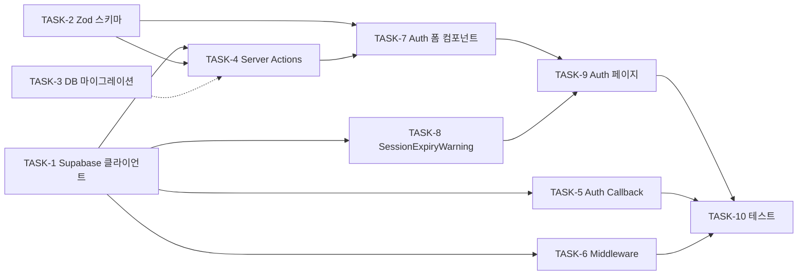

# Spec: Supabase Auth

> Task: 1.3 | 상태: approved-tasks | 작성일: 2026-03-12

## 1. 개요 (Overview)

Findably의 사용자 인증 시스템. 이메일+비밀번호와 Google OAuth 두 가지 방식으로 회원가입/로그인을 제공하며, 이메일 인증 필수, 비밀번호 재설정, 세션 관리, 라우트 보호를 포함한다.
건당 과금 모델의 기반이 되는 사용자 식별 체계로, 모든 인증 후속 기능(진단 요청, 결제, 리포트 조회)의 전제조건이다.

## 2. 요구사항 (Requirements)

### 기능 요구사항 (Functional)

- REQ-1: 이메일+비밀번호로 회원가입할 수 있다 (비밀번호 최소 8자)
- REQ-2: Google OAuth로 회원가입/로그인할 수 있다
- REQ-3: 회원가입 후 이메일 인증 메일이 발송되고, 인증 완료 전까지 서비스 이용이 제한된다
- REQ-4: 이메일+비밀번호로 로그인할 수 있다
- REQ-5: 로그아웃할 수 있다
- REQ-6: "비밀번호 찾기" → 이메일로 재설정 링크 발송 → 새 비밀번호 설정이 가능하다
- REQ-7: 비인증 사용자가 보호 라우트 접근 시 `/login`으로 리다이렉트된다
- REQ-8: 세션 만료 5분 전 경고 알림을 표시하고, 만료 시 `/login`으로 리다이렉트된다
- REQ-9: 랜딩페이지의 CTA("무료 진단 시작") 클릭 시 비로그인 상태면 `/signup`으로 이동한다

### 비기능 요구사항 (Non-Functional)

- NFR-1: 보안 — 비밀번호는 Supabase Auth가 bcrypt로 해싱 (직접 저장 금지)
- NFR-2: 보안 — 모든 인증 관련 입력은 Zod 스키마로 서버 측 검증
- NFR-3: 보안 — CSRF 보호는 Supabase Auth의 PKCE flow 사용
- NFR-4: 성능 — 로그인/회원가입 응답 2초 이내
- NFR-5: 접근성 — 폼 필드에 aria-label, 에러 메시지에 aria-live="polite"
- NFR-6: 보안 — 에러 메시지에서 "이 이메일은 이미 등록되어 있습니다" 같은 계정 존재 여부 노출 금지 → "이메일 또는 비밀번호를 확인해주세요"로 통일

## 3. 사용자 스토리 (User Stories)

- US-1: 신규 사용자로서, 이메일과 비밀번호로 가입하면, 이메일 인증 후 서비스를 이용할 수 있다.
- US-2: 신규 사용자로서, Google 계정으로 가입하면, 별도 인증 없이 바로 서비스를 이용할 수 있다.
- US-3: 기존 사용자로서, 로그인하면, 이전 진단 결과와 대시보드에 접근할 수 있다.
- US-4: 기존 사용자로서, 비밀번호를 잊었을 때 재설정할 수 있다.
- US-5: 비로그인 사용자로서, "무료 진단 시작" 버튼을 누르면, 회원가입 페이지로 안내된다.

## 4. 수용 기준 (Acceptance Criteria)

### AC-1: 이메일 회원가입 성공

- Given: `/signup` 페이지에 접속한 비로그인 사용자
- When: 유효한 이메일과 8자 이상 비밀번호를 입력하고 "가입하기 →" 클릭
- Then: 가입 처리 후 "인증 이메일을 보냈습니다. 메일함을 확인해주세요" 안내 페이지 표시

### AC-2: Google OAuth 가입/로그인 성공

- Given: `/signup` 또는 `/login` 페이지에 접속한 비로그인 사용자
- When: "Google로 계속하기" 버튼 클릭 → Google 인증 완료
- Then: `/onboarding/url`로 리다이렉트 (신규) 또는 `/dashboard`로 리다이렉트 (기존)

### AC-3: 이메일 인증 완료

- Given: 이메일 가입 후 인증 대기 중인 사용자
- When: 인증 메일의 링크 클릭
- Then: 이메일 인증 완료 → `/onboarding/url`로 리다이렉트

### AC-4: 이메일 로그인 성공

- Given: `/login` 페이지에 접속한 인증 완료된 기존 사용자
- When: 올바른 이메일과 비밀번호 입력 후 "로그인 →" 클릭
- Then: `/dashboard`로 리다이렉트

### AC-5: 로그인 실패 — 잘못된 자격증명

- Given: `/login` 페이지
- When: 잘못된 이메일 또는 비밀번호 입력
- Then: "이메일 또는 비밀번호를 확인해주세요" 에러 메시지 표시 (계정 존재 여부 노출 금지)

### AC-6: 비밀번호 재설정

- Given: `/login` 페이지에서 "비밀번호를 잊으셨나요?" 클릭
- When: 이메일 입력 후 "재설정 링크 보내기" 클릭
- Then: "비밀번호 재설정 링크를 보냈습니다" 메시지 표시 → 이메일 링크로 새 비밀번호 설정 가능

### AC-7: 보호 라우트 접근 차단

- Given: 비로그인 사용자
- When: `/dashboard`, `/onboarding/*`, `/diagnosis/*` 등 보호 라우트에 직접 접근
- Then: `/login`으로 리다이렉트, 로그인 후 원래 요청 URL로 복귀

### AC-8: 세션 만료 경고 및 리다이렉트

- Given: 로그인된 사용자의 세션이 만료 5분 전
- When: 세션 만료 임박
- Then: 화면 상단에 "세션이 곧 만료됩니다. 계속 사용하시겠습니까?" 알림 표시 → 만료 시 `/login`으로 리다이렉트

### AC-9: 회원가입 유효성 검증

- Given: `/signup` 페이지
- When: 빈 이메일, 잘못된 이메일 형식, 8자 미만 비밀번호 입력
- Then: 각 필드 하단에 구체적 에러 메시지 표시 (클라이언트+서버 양쪽 검증)

### AC-10: 로그아웃

- Given: 로그인된 사용자
- When: 로그아웃 버튼 클릭
- Then: 세션 삭제 → `/` (랜딩)으로 리다이렉트

## 5. 범위 밖 (Out of Scope)

- 소셜 로그인 확장 (Kakao, Naver 등) — Phase 2 이후
- 2FA (이중 인증) — Phase 2 이후
- 관리자 계정/역할 관리 — Phase 2 이후
- 회원 탈퇴 기능 — Phase 2 이후
- 프로필 수정 (닉네임, 프로필 사진) — Phase 2 이후

## 6. 참조

- PRD: Task 1.3 (line 336), 보안 등급 🟡 (line 444)
- spec.md: 섹션 2-1 회원가입, 2-2 로그인, 4-1 인증 API, 8 접근 제어
- User Flow: F-001 (/ → /signup → /onboarding/url)

## 7. 기술 설계 (Technical Design)

### 7.1 컴포넌트 구조

```
AuthLayout (Server Component — /login, /signup, /reset-password, /update-password 공용)
├── SignupForm (Client) — 이메일+비밀번호 입력, Zod 검증, Server Action 호출
├── LoginForm (Client) — 이메일+비밀번호 입력, 에러 통일 메시지
├── GoogleAuthButton (Client) — supabase.auth.signInWithOAuth 호출
├── PasswordResetRequestForm (Client) — 이메일 입력 → 재설정 링크 발송
├── UpdatePasswordForm (Client) — 새 비밀번호 입력 (recovery 콜백 후)
└── EmailVerificationNotice (Server) — "메일함을 확인해주세요" 안내 화면

SessionExpiryWarning (Client — RootLayout에 삽입)
└── 만료 5분 전 토스트 알림 + "계속 사용" 버튼 + 만료 시 /login 리다이렉트
```

### 7.2 데이터 흐름

**이메일 회원가입:**

```
SignupForm → signupAction (Server Action)
  → Zod 검증 (이메일 형식, 비밀번호 8자+)
  → supabase.auth.signUp({ email, password })
  → 성공 → /signup/confirm 리다이렉트 (EmailVerificationNotice)
  → 실패 → 에러 메시지 반환 (계정 존재 여부 통일 메시지)
```

**이메일 인증 완료:**

```
이메일 링크 클릭 → /auth/callback?token_hash=...&type=email
  → Route Handler: 토큰 교환 (supabase.auth.verifyOtp)
  → 신규 사용자 → /onboarding/url 리다이렉트
```

**Google OAuth:**

```
GoogleAuthButton → supabase.auth.signInWithOAuth({ provider: 'google' })
  → Google 로그인 화면 → 인증 완료
  → /auth/callback?code=... (Supabase PKCE flow)
  → Route Handler: code → session 교환
  → 신규 (profiles 없음) → /onboarding/url
  → 기존 (profiles 있음) → /dashboard
```

**이메일 로그인:**

```
LoginForm → loginAction (Server Action)
  → Zod 검증
  → supabase.auth.signInWithPassword({ email, password })
  → 성공 → /dashboard 리다이렉트 (또는 redirectTo 파라미터)
  → 실패 → "이메일 또는 비밀번호를 확인해주세요" (NFR-6)
```

**비밀번호 재설정:**

```
PasswordResetRequestForm → resetPasswordAction (Server Action)
  → supabase.auth.resetPasswordForEmail(email, { redirectTo: '/auth/callback?type=recovery' })
  → 항상 "재설정 링크를 보냈습니다" 표시 (계정 존재 여부 노출 방지)

이메일 링크 클릭 → /auth/callback?type=recovery&code=...
  → Route Handler: code → session 교환
  → /update-password 리다이렉트

UpdatePasswordForm → updatePasswordAction (Server Action)
  → supabase.auth.updateUser({ password: newPassword })
  → /login 리다이렉트 + "비밀번호가 변경되었습니다" 토스트
```

**로그아웃:**

```
로그아웃 버튼 → logoutAction (Server Action)
  → supabase.auth.signOut()
  → / (랜딩) 리다이렉트
```

**세션 만료 경고:**

```
SessionExpiryWarning (Client)
  → onAuthStateChange로 session.expires_at 감시
  → 만료 5분 전 → 토스트 알림 표시
  → "계속 사용" 클릭 → supabase.auth.refreshSession()
  → 만료 → /login 리다이렉트
```

### 7.3 API 설계

#### Server Actions (features/auth/actions/)

| Action               | 파일               | 입력                  | 출력                  | 비고                     |
| -------------------- | ------------------ | --------------------- | --------------------- | ------------------------ |
| signupAction         | signup.ts          | `{ email, password }` | `{ error?: string }`  | Zod 검증 → signUp        |
| loginAction          | login.ts           | `{ email, password }` | `{ error?: string }`  | 에러 메시지 통일 (NFR-6) |
| logoutAction         | logout.ts          | 없음                  | redirect('/')         | signOut → 리다이렉트     |
| resetPasswordAction  | reset-password.ts  | `{ email }`           | `{ message: string }` | 항상 동일 메시지         |
| updatePasswordAction | update-password.ts | `{ password }`        | `{ error?: string }`  | 세션 필수                |

#### Route Handler

| 경로           | 메서드 | 역할                                                    |
| -------------- | ------ | ------------------------------------------------------- |
| /auth/callback | GET    | OAuth code 교환, 이메일 인증, 비밀번호 재설정 토큰 처리 |

### 7.4 DB 스키마

spec.md의 profiles 테이블을 그대로 사용. 추가 변경 없음:

```sql
-- spec.md 5-1에서 정의된 기존 스키마
CREATE TABLE profiles (
  id UUID PRIMARY KEY REFERENCES auth.users(id) ON DELETE CASCADE,
  display_name TEXT,
  industry TEXT,
  created_at TIMESTAMPTZ DEFAULT now(),
  updated_at TIMESTAMPTZ DEFAULT now()
);

-- 자동 프로필 생성 트리거 (신규)
CREATE OR REPLACE FUNCTION handle_new_user()
RETURNS TRIGGER AS $$
BEGIN
  INSERT INTO public.profiles (id, display_name)
  VALUES (
    NEW.id,
    COALESCE(NEW.raw_user_meta_data ->> 'full_name', NEW.email)
  );
  RETURN NEW;
END;
$$ LANGUAGE plpgsql SECURITY DEFINER;

CREATE TRIGGER on_auth_user_created
  AFTER INSERT ON auth.users
  FOR EACH ROW
  EXECUTE FUNCTION handle_new_user();

-- RLS 정책
ALTER TABLE profiles ENABLE ROW LEVEL SECURITY;

CREATE POLICY "Users can read own profile"
  ON profiles FOR SELECT
  USING (auth.uid() = id);

CREATE POLICY "Users can update own profile"
  ON profiles FOR UPDATE
  USING (auth.uid() = id);
```

### 7.5 상태 관리

- **서버 상태**: middleware에서 `supabase.auth.getUser()`로 세션 확인 → 보호 라우트 판별
- **서버 컴포넌트**: `createClient()` (server)로 사용자 정보 조회
- **클라이언트 상태**:
  - `SessionExpiryWarning`: `onAuthStateChange` + `session.expires_at` 기반 타이머
  - 폼 상태: React 기본 (`useActionState` + Server Action)
- **캐싱**: 인증 데이터는 캐싱 없음 (매 요청 fresh 확인)

### 7.6 에러 처리

| 시나리오               | 기술 처리                  | 사용자 메시지                                              |
| ---------------------- | -------------------------- | ---------------------------------------------------------- |
| 잘못된 이메일/비밀번호 | Supabase AuthApiError 캐치 | "이메일 또는 비밀번호를 확인해주세요"                      |
| 이미 가입된 이메일     | signUp 에러 캐치           | "이메일 또는 비밀번호를 확인해주세요" (NFR-6: 동일 메시지) |
| 이메일 형식 오류       | Zod 클라이언트 검증        | "올바른 이메일 형식을 입력해주세요"                        |
| 비밀번호 8자 미만      | Zod 클라이언트 검증        | "비밀번호는 8자 이상이어야 합니다"                         |
| Google OAuth 취소      | 콜백 error 파라미터        | "로그인이 취소되었습니다" → /login 복귀                    |
| 네트워크 오류          | fetch 실패 캐치            | "네트워크 연결을 확인해주세요"                             |
| 세션 만료              | middleware getUser 실패    | /login 리다이렉트 (자동)                                   |
| 인증 토큰 만료/무효    | verifyOtp 실패             | "링크가 만료되었습니다. 다시 요청해주세요"                 |

### 7.7 보안 고려사항

- **PKCE Flow**: Supabase Auth 기본 PKCE 사용 (CSRF 보호 내장)
- **서버 측 검증**: 모든 Server Action에서 Zod 스키마 검증 (클라이언트 검증은 UX용)
- **계정 열거 방지 (NFR-6)**: 로그인 실패, 가입 실패, 비밀번호 재설정 모두 동일한 일반 메시지 반환
- **쿠키 보안**: `@supabase/ssr`이 httpOnly, secure, sameSite 쿠키 자동 관리
- **세션 갱신**: middleware에서 매 요청 시 `getUser()` 호출 → 세션 자동 갱신
- **RLS**: profiles 테이블에 행 수준 보안 정책 적용 (자기 프로필만 읽기/수정)
- **환경 변수**: NEXT_PUBLIC_SUPABASE_URL, NEXT_PUBLIC_SUPABASE_ANON_KEY는 .env.local에서 관리

### 7.8 파일 구조

| 파일 경로                                                   | 역할                                                           | Server/Client |
| ----------------------------------------------------------- | -------------------------------------------------------------- | ------------- |
| `src/lib/supabase/server.ts`                                | createServerClient 팩토리 (쿠키 기반)                          | Server        |
| `src/lib/supabase/client.ts`                                | createBrowserClient 팩토리                                     | Client        |
| `src/middleware.ts`                                         | 세션 갱신 + 라우트 보호 + redirectTo                           | Server        |
| `src/features/auth/actions/signup.ts`                       | signupAction Server Action                                     | Server        |
| `src/features/auth/actions/login.ts`                        | loginAction Server Action                                      | Server        |
| `src/features/auth/actions/logout.ts`                       | logoutAction Server Action                                     | Server        |
| `src/features/auth/actions/reset-password.ts`               | resetPasswordAction Server Action                              | Server        |
| `src/features/auth/actions/update-password.ts`              | updatePasswordAction Server Action                             | Server        |
| `src/features/auth/schemas.ts`                              | Zod 검증 스키마 (signup, login, resetPassword, updatePassword) | Shared        |
| `src/features/auth/components/SignupForm.tsx`               | 회원가입 폼                                                    | Client        |
| `src/features/auth/components/LoginForm.tsx`                | 로그인 폼                                                      | Client        |
| `src/features/auth/components/GoogleAuthButton.tsx`         | Google OAuth 버튼                                              | Client        |
| `src/features/auth/components/PasswordResetRequestForm.tsx` | 비밀번호 재설정 요청 폼                                        | Client        |
| `src/features/auth/components/UpdatePasswordForm.tsx`       | 새 비밀번호 입력 폼                                            | Client        |
| `src/features/auth/components/SessionExpiryWarning.tsx`     | 세션 만료 경고 알림                                            | Client        |
| `src/app/(auth)/layout.tsx`                                 | 인증 페이지 공통 레이아웃 (중앙 정렬, max-w-md)                | Server        |
| `src/app/(auth)/login/page.tsx`                             | 로그인 페이지                                                  | Server        |
| `src/app/(auth)/signup/page.tsx`                            | 회원가입 페이지                                                | Server        |
| `src/app/(auth)/signup/confirm/page.tsx`                    | 이메일 인증 안내 페이지                                        | Server        |
| `src/app/(auth)/reset-password/page.tsx`                    | 비밀번호 재설정 요청 페이지                                    | Server        |
| `src/app/(auth)/update-password/page.tsx`                   | 새 비밀번호 입력 페이지                                        | Server        |
| `src/app/auth/callback/route.ts`                            | OAuth/이메일인증/비밀번호재설정 콜백 핸들러                    | Server        |
| `supabase/migrations/001_profiles.sql`                      | profiles 테이블 + 트리거 + RLS                                 | DB            |

---

## 8. 구현 태스크 (Implementation Tasks)

### TASK-1: Supabase 클라이언트 + 환경 변수 설정

- **파일**:
  - `src/lib/supabase/server.ts` (생성)
  - `src/lib/supabase/client.ts` (생성)
  - `.env.local` (생성)
  - `.env.example` (생성)
- **내용**: `@supabase/ssr`의 `createServerClient`/`createBrowserClient` 팩토리 함수 구현. 쿠키 getAll/setAll 패턴 적용. 환경 변수 네이밍은 실제 Supabase 버전에 맞춰 결정 (validate-design 권고 #2 반영)
- **완료 기준**:
  - [ ] `createClient()` (server) 호출 시 쿠키 기반 세션 관리 동작
  - [ ] `createClient()` (client) 호출 시 브라우저 세션 관리 동작
  - [ ] `.env.example`에 필수 환경 변수 목록 문서화
  - [ ] 환경 변수 누락 시 빌드 타임 에러 발생 확인
- **의존성**: 없음
- **예상 시간**: 45분

### TASK-2: Zod 검증 스키마 정의

- **파일**:
  - `src/features/auth/schemas.ts` (생성)
- **내용**: signup, login, resetPassword, updatePassword 4개 Zod 스키마 정의. 이메일 형식, 비밀번호 최소 8자 등 검증 규칙 포함. 에러 메시지 한국어
- **완료 기준**:
  - [ ] `signupSchema`: email(이메일 형식) + password(8자+) 검증 통과
  - [ ] `loginSchema`: email + password 검증 통과
  - [ ] `resetPasswordSchema`: email 검증 통과
  - [ ] `updatePasswordSchema`: password(8자+) 검증 통과
  - [ ] 잘못된 입력 시 한국어 에러 메시지 반환
  - [ ] AC-9 통과 (유효성 검증 에러 메시지)
- **의존성**: 없음
- **예상 시간**: 30분

### TASK-3: DB 마이그레이션 (profiles + 트리거 + RLS)

- **파일**:
  - `supabase/migrations/001_profiles.sql` (생성)
- **내용**: profiles 테이블, handle_new_user 트리거 (auth.users INSERT 시 자동 프로필 생성), RLS 정책 (own row SELECT/UPDATE). 롤백 SQL 포함
- **완료 기준**:
  - [ ] profiles 테이블 생성 완료 (id, display_name, industry, created_at, updated_at)
  - [ ] auth.users에 INSERT 시 profiles에 자동 행 생성
  - [ ] RLS: 본인 프로필만 SELECT/UPDATE 가능
  - [ ] 롤백 SQL 포함 (DROP TABLE, DROP FUNCTION, DROP TRIGGER)
  - [ ] Supabase Dashboard에서 마이그레이션 적용 확인
- **의존성**: 없음
- **예상 시간**: 30분

### TASK-4: Server Actions 구현 (5개)

- **파일**:
  - `src/features/auth/actions/signup.ts` (생성)
  - `src/features/auth/actions/login.ts` (생성)
  - `src/features/auth/actions/logout.ts` (생성)
  - `src/features/auth/actions/reset-password.ts` (생성)
  - `src/features/auth/actions/update-password.ts` (생성)
- **내용**: 각 Action에서 Zod 검증 → Supabase Auth API 호출 → 결과/에러 반환. NFR-6 계정 열거 방지 메시지 통일. `'use server'` 선언
- **완료 기준**:
  - [ ] signupAction: Zod 검증 → signUp → 성공 시 /signup/confirm 리다이렉트
  - [ ] loginAction: Zod 검증 → signInWithPassword → 성공 시 /dashboard (또는 redirectTo)
  - [ ] logoutAction: signOut → / 리다이렉트
  - [ ] resetPasswordAction: resetPasswordForEmail → 항상 동일 메시지 반환
  - [ ] updatePasswordAction: updateUser → /login 리다이렉트
  - [ ] 모든 에러 메시지에서 계정 존재 여부 노출 없음 (NFR-6)
  - [ ] AC-1 통과 (이메일 회원가입)
  - [ ] AC-4 통과 (이메일 로그인)
  - [ ] AC-5 통과 (로그인 실패 메시지)
  - [ ] AC-6 통과 (비밀번호 재설정)
  - [ ] AC-10 통과 (로그아웃)
- **의존성**: TASK-1, TASK-2
- **예상 시간**: 1.5시간

### TASK-5: Auth Callback Route Handler

- **파일**:
  - `src/app/auth/callback/route.ts` (생성)
- **내용**: GET 핸들러 — code/token_hash 파라미터에 따라 OAuth code 교환, 이메일 인증(verifyOtp), 비밀번호 재설정(recovery) 분기 처리. 에러 시 /login 리다이렉트 + error 파라미터
- **완료 기준**:
  - [ ] OAuth code → exchangeCodeForSession 성공 → 신규 /onboarding/url, 기존 /dashboard
  - [ ] 이메일 인증 token_hash → verifyOtp 성공 → /onboarding/url 리다이렉트
  - [ ] recovery type → code 교환 → /update-password 리다이렉트
  - [ ] 에러 시 /login?error=... 리다이렉트 (사용자 메시지 포함)
  - [ ] AC-2 통과 (Google OAuth 콜백)
  - [ ] AC-3 통과 (이메일 인증 콜백)
- **의존성**: TASK-1
- **예상 시간**: 1시간

### TASK-6: Middleware 구현 (세션 갱신 + 라우트 보호)

- **파일**:
  - `src/middleware.ts` (생성)
- **내용**: 매 요청 시 supabase.auth.getUser()로 세션 갱신. 보호 라우트 매칭 → 미인증 시 /login?redirectTo=원래URL 리다이렉트. 이미 로그인된 사용자가 /login, /signup 접근 시 /dashboard 리다이렉트. config.matcher 설정
- **완료 기준**:
  - [ ] 보호 라우트 (/dashboard, /onboarding/_, /diagnosis/_, /reports/my/_, /actions/_, /settings/\*) 접근 시 미인증 → /login 리다이렉트
  - [ ] redirectTo 파라미터로 원래 URL 전달 → 로그인 후 복귀
  - [ ] 인증된 사용자의 /login, /signup 접근 → /dashboard 리다이렉트
  - [ ] 퍼블릭 라우트 (/, /pricing, /reports/sample) 는 통과
  - [ ] 세션 갱신 (getUser 호출) 매 요청 동작
  - [ ] AC-7 통과 (보호 라우트 접근 차단 + 로그인 후 복귀)
- **의존성**: TASK-1
- **예상 시간**: 1시간

### TASK-7: Auth 폼 컴포넌트 (5개)

- **파일**:
  - `src/features/auth/components/SignupForm.tsx` (생성)
  - `src/features/auth/components/LoginForm.tsx` (생성)
  - `src/features/auth/components/GoogleAuthButton.tsx` (생성)
  - `src/features/auth/components/PasswordResetRequestForm.tsx` (생성)
  - `src/features/auth/components/UpdatePasswordForm.tsx` (생성)
- **내용**: 'use client' 컴포넌트. shadcn/ui (Button, Input, Label, Card) 활용. useActionState로 Server Action 연결. Zod 클라이언트 검증 + 에러 표시. 접근성 (aria-label, aria-live). 디자인 시스템 토큰 적용
- **완료 기준**:
  - [ ] SignupForm: 이메일+비밀번호 입력 → 클라이언트 검증 → signupAction 호출
  - [ ] LoginForm: 이메일+비밀번호 입력 → loginAction 호출 → 에러 통일 메시지
  - [ ] GoogleAuthButton: supabase.auth.signInWithOAuth 호출 → Google 로그인 화면
  - [ ] PasswordResetRequestForm: 이메일 입력 → resetPasswordAction 호출
  - [ ] UpdatePasswordForm: 새 비밀번호 입력 → updatePasswordAction 호출
  - [ ] 모든 폼에 aria-label, 에러 aria-live="polite" 적용 (NFR-5)
  - [ ] shadcn/ui 컴포넌트 활용 (직접 HTML 폼 금지)
  - [ ] AC-9 통과 (클라이언트 유효성 검증 에러 표시)
- **의존성**: TASK-2, TASK-4
- **예상 시간**: 1.5시간

### TASK-8: SessionExpiryWarning 컴포넌트

- **파일**:
  - `src/features/auth/components/SessionExpiryWarning.tsx` (생성)
  - `src/app/layout.tsx` (수정 — SessionExpiryWarning 삽입)
- **내용**: 'use client'. onAuthStateChange로 session.expires_at 감시 → 만료 5분 전 토스트 알림 → "계속 사용" 클릭 시 refreshSession → 만료 시 /login 리다이렉트. RootLayout에 조건부 렌더링 (로그인 상태에서만)
- **완료 기준**:
  - [ ] 세션 만료 5분 전 화면 상단에 경고 알림 표시
  - [ ] "계속 사용" 버튼 클릭 시 세션 갱신
  - [ ] 세션 만료 시 /login으로 자동 리다이렉트
  - [ ] 비로그인 상태에서는 렌더링 안 됨
  - [ ] prefers-reduced-motion 대응
  - [ ] AC-8 통과 (세션 만료 경고 + 리다이렉트)
- **의존성**: TASK-1
- **예상 시간**: 45분

### TASK-9: Auth 페이지 + 레이아웃

- **파일**:
  - `src/app/(auth)/layout.tsx` (생성)
  - `src/app/(auth)/login/page.tsx` (생성)
  - `src/app/(auth)/login/error.tsx` (생성) — validate-design 권고 #1 반영
  - `src/app/(auth)/login/loading.tsx` (생성) — validate-design 권고 #1 반영
  - `src/app/(auth)/signup/page.tsx` (생성)
  - `src/app/(auth)/signup/error.tsx` (생성)
  - `src/app/(auth)/signup/loading.tsx` (생성)
  - `src/app/(auth)/signup/confirm/page.tsx` (생성)
  - `src/app/(auth)/reset-password/page.tsx` (생성)
  - `src/app/(auth)/reset-password/error.tsx` (생성)
  - `src/app/(auth)/reset-password/loading.tsx` (생성)
  - `src/app/(auth)/update-password/page.tsx` (생성)
  - `src/app/(auth)/update-password/error.tsx` (생성)
  - `src/app/(auth)/update-password/loading.tsx` (생성)
- **내용**: Server Component 페이지. (auth) 레이아웃 = 중앙 정렬 카드 (max-w-md). 각 페이지에서 해당 폼 컴포넌트 임포트. error.tsx + loading.tsx 각 라우트에 생성 (nextjs.md 규칙). EmailVerificationNotice = signup/confirm 페이지
- **완료 기준**:
  - [ ] (auth)/layout.tsx: 중앙 정렬, 로고, 배경 텍스처 적용
  - [ ] login/page.tsx: LoginForm + GoogleAuthButton + "회원가입" 링크 + "비밀번호 찾기" 링크
  - [ ] signup/page.tsx: SignupForm + GoogleAuthButton + "로그인" 링크
  - [ ] signup/confirm/page.tsx: "메일함을 확인해주세요" 안내 화면
  - [ ] reset-password/page.tsx: PasswordResetRequestForm
  - [ ] update-password/page.tsx: UpdatePasswordForm
  - [ ] 모든 라우트에 error.tsx + loading.tsx 존재
  - [ ] 디자인 시스템 토큰 (색상, 폰트, 간격) 적용
  - [ ] AC-1 통과 (회원가입 → 인증 안내 화면 표시)
  - [ ] AC-6 통과 (비밀번호 재설정 페이지 흐름)
- **의존성**: TASK-7, TASK-8
- **예상 시간**: 1.5시간

### TASK-10: 테스트 + 통합 검증

- **파일**:
  - `src/features/auth/__tests__/schemas.test.ts` (생성)
  - `src/features/auth/__tests__/actions.test.ts` (생성)
  - `src/features/auth/__tests__/SessionExpiryWarning.test.ts` (생성) — validate-design 권고 #3 반영
  - `e2e/auth.spec.ts` (생성)
- **내용**: Zod 스키마 단위 테스트, Server Action 통합 테스트 (Supabase mock), SessionExpiryWarning 컴포넌트 테스트, E2E 테스트 (회원가입 → 로그인 → 로그아웃 flow). 검증 게이트 (tsc → eslint → build → test) 통과
- **완료 기준**:
  - [ ] Zod 스키마: 유효/무효 입력 케이스 테스트 통과
  - [ ] Server Actions: 성공/실패 시나리오 테스트 통과
  - [ ] SessionExpiryWarning: 타이머 + 갱신 + 리다이렉트 테스트 통과
  - [ ] E2E: 이메일 가입 → 로그인 → 대시보드 접근 → 로그아웃 플로우 통과
  - [ ] `npx tsc --noEmit` 통과
  - [ ] `npx eslint .` 통과
  - [ ] `pnpm build` 통과
  - [ ] `pnpm test` 통과 (커버리지 80%+)
  - [ ] AC-1~AC-10 전체 수동 검증 완료
- **의존성**: TASK-1~TASK-9 전체
- **예상 시간**: 1.5시간

---

## 9. 개발 순서 (Execution Order)



**추천 순서**: TASK-1 → TASK-2 → TASK-3 → TASK-4 → TASK-5 + TASK-6 (병렬) → TASK-7 + TASK-8 (병렬) → TASK-9 → TASK-10

**병렬 가능 구간**:

- TASK-1 + TASK-2 + TASK-3 (의존성 없음 — 동시 시작 가능)
- TASK-5 + TASK-6 (둘 다 TASK-1만 의존)
- TASK-7 + TASK-8 (서로 독립)

---

## 10. AC ↔ TASK 매핑

| 수용 기준             | 관련 태스크                                                                                                | 검증 방법                                           |
| --------------------- | ---------------------------------------------------------------------------------------------------------- | --------------------------------------------------- |
| AC-1: 이메일 회원가입 | TASK-4 (signupAction), TASK-7 (SignupForm), TASK-9 (signup 페이지)                                         | E2E: 가입 → 인증 안내 화면                          |
| AC-2: Google OAuth    | TASK-5 (callback), TASK-7 (GoogleAuthButton), TASK-9 (login 페이지)                                        | 수동: Google 로그인 → 대시보드                      |
| AC-3: 이메일 인증     | TASK-4 (signupAction), TASK-5 (callback - verifyOtp)                                                       | 수동: 인증 메일 링크 클릭 → 온보딩                  |
| AC-4: 이메일 로그인   | TASK-4 (loginAction), TASK-7 (LoginForm), TASK-9 (login 페이지)                                            | E2E: 로그인 → 대시보드                              |
| AC-5: 로그인 실패     | TASK-4 (loginAction - 에러), TASK-7 (LoginForm - 에러 표시)                                                | 단위: 통일 에러 메시지 확인                         |
| AC-6: 비밀번호 재설정 | TASK-4 (resetPassword, updatePassword), TASK-5 (callback - recovery), TASK-7 (폼 2개), TASK-9 (페이지 2개) | 수동: 전체 재설정 플로우                            |
| AC-7: 보호 라우트     | TASK-6 (middleware)                                                                                        | E2E: 비로그인 → /dashboard → /login 리다이렉트 확인 |
| AC-8: 세션 만료       | TASK-8 (SessionExpiryWarning)                                                                              | 컴포넌트 테스트: 타이머 + 알림 + 리다이렉트         |
| AC-9: 회원가입 검증   | TASK-2 (Zod 스키마), TASK-7 (SignupForm - 에러 표시)                                                       | 단위: Zod 스키마 + E2E: 폼 에러 표시                |
| AC-10: 로그아웃       | TASK-4 (logoutAction)                                                                                      | E2E: 로그아웃 → 랜딩 리다이렉트                     |

**AC 커버리지: 10/10개 (100%)**

---

## 부록 B: 설계 검증 결과

> 검증일: 2026-03-13 | 검증 대상: 22개 파일, 5개 Server Action, 1개 Route Handler

### 1. 아키텍처 정합성

| 설계 항목          | 기존 패턴                                     | 일치 여부 | 비고                                       |
| ------------------ | --------------------------------------------- | --------- | ------------------------------------------ |
| 폴더 구조          | features/ 모듈                                | ✅        | `src/features/auth/` — CLAUDE.md 규칙 준수 |
| Server/Client 분리 | SC 기본 + 'use client'                        | ✅        | 페이지=SC, 폼/버튼=CC — nextjs.md 준수     |
| 상태 관리          | Server: getUser() / Client: onAuthStateChange | ✅        | 서버 우선 패턴                             |
| 에러 처리          | 8개 시나리오 + 사용자 메시지                  | ✅        | console.log만 금지 규칙 준수               |

### 2. 컴포넌트 충돌

| 설계 컴포넌트            | 기존 유사 컴포넌트             | 판정      |
| ------------------------ | ------------------------------ | --------- |
| SignupForm               | 없음                           | 🆕 신규   |
| LoginForm                | 없음                           | 🆕 신규   |
| GoogleAuthButton         | 없음                           | 🆕 신규   |
| PasswordResetRequestForm | 없음                           | 🆕 신규   |
| UpdatePasswordForm       | 없음                           | 🆕 신규   |
| SessionExpiryWarning     | 없음                           | 🆕 신규   |
| (auth)/layout.tsx        | 없음                           | 🆕 신규   |
| middleware.ts            | 없음                           | 🆕 신규   |
| Button (shadcn)          | `src/components/ui/button.tsx` | 🔄 재사용 |
| Input (shadcn)           | `src/components/ui/input.tsx`  | 🔄 재사용 |
| Label (shadcn)           | `src/components/ui/label.tsx`  | 🔄 재사용 |
| Card (shadcn)            | `src/components/ui/card.tsx`   | 🔄 재사용 |

충돌: 0건

### 3. API/DB 충돌

| 설계 엔드포인트                      | 기존 엔드포인트 | 판정    |
| ------------------------------------ | --------------- | ------- |
| signupAction (Server Action)         | 없음            | 🆕 신규 |
| loginAction (Server Action)          | 없음            | 🆕 신규 |
| logoutAction (Server Action)         | 없음            | 🆕 신규 |
| resetPasswordAction (Server Action)  | 없음            | 🆕 신규 |
| updatePasswordAction (Server Action) | 없음            | 🆕 신규 |
| /auth/callback (Route Handler)       | 없음            | 🆕 신규 |

| 설계 테이블/컬럼                        | 기존 스키마                     | 판정    |
| --------------------------------------- | ------------------------------- | ------- |
| profiles (id, email, display_name, ...) | 없음 (spec.md §5-1과 동일 구조) | 🆕 신규 |
| handle_new_user 트리거                  | 없음                            | 🆕 신규 |
| RLS 정책 (own row CRUD)                 | 없음                            | 🆕 신규 |

충돌: 0건

### 4. 규칙 준수

| 규칙                    | 출처          | 준수 여부 | 비고                                              |
| ----------------------- | ------------- | --------- | ------------------------------------------------- |
| any 금지                | typescript.md | ✅        | Zod 스키마 + 구체적 타입 설계                     |
| RLS 필수                | supabase.md   | ✅        | own row SELECT/UPDATE 정책                        |
| SC 기본                 | nextjs.md     | ✅        | 페이지=SC, 폼=CC                                  |
| shadcn 우선             | nextjs.md     | ✅        | Button/Input/Label/Card 재사용                    |
| error.tsx + loading.tsx | nextjs.md     | ⚠️        | 7.8 파일 구조에 미포함 — spec-tasks에서 추가 필요 |
| 보안 등급 준수          | security.md   | ✅        | 🟡 등급 — Supabase Auth 검증 라이브러리 사용      |

### 5. 리스크 평가

| 리스크                             | 심각도 | 설명                                                        | 대응 방안                                    |
| ---------------------------------- | ------ | ----------------------------------------------------------- | -------------------------------------------- |
| 환경 변수 네이밍                   | 🟡     | 최신 Supabase는 `ANON_KEY` → `PUBLISHABLE_KEY` 변경 가능    | spec-tasks에서 실제 버전 확인 후 결정        |
| SessionExpiryWarning 복잡도        | 🟡     | 클라이언트 타이머 + onAuthStateChange + refreshSession 조합 | 구현 시 테스트 커버리지 확보                 |
| error.tsx/loading.tsx 누락         | 🟡     | nextjs.md 규칙 위반 — 파일 구조에서 빠짐                    | spec-tasks에서 TASK에 포함                   |
| spec.md getSession vs 설계 getUser | 🟢     | spec.md §4-1이 getSession 참조, 설계는 getUser 사용         | 설계가 정확 (서버 검증), spec.md는 추후 갱신 |
| OAuth 신규/기존 사용자 구분        | 🟢     | auto-create 트리거 시 타이밍                                | Supabase 내장 동작으로 해결                  |

### 종합 판정

| 항목            | 결과                                      |
| --------------- | ----------------------------------------- |
| 아키텍처 정합성 | ✅ PASS                                   |
| 컴포넌트 충돌   | ✅ PASS                                   |
| API/DB 충돌     | ✅ PASS                                   |
| 규칙 준수       | ⚠️ WARNING (error.tsx/loading.tsx 미포함) |
| 리스크          | ⚠️ WARNING (🟡 3건, 🟢 2건)               |

**최종**: ⚠️ 수정 후 승인 — WARNING 3건 모두 경미하며 spec-tasks 단계에서 반영 가능
